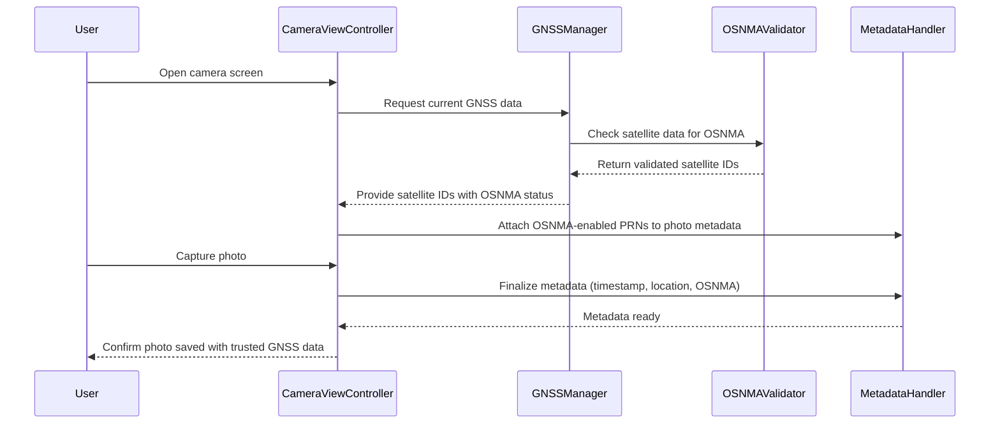

# 📸🛰️ UML Sequence Diagram: `OSNMAEnabled` with `CameraViewController` (PIC2BIM iOS)

This diagram illustrates the interaction between the `CameraViewController` and GNSS-related components responsible for handling OSNMA (Open Service Navigation Message Authentication) functionality in the PIC2BIM iOS application.

---

## 🔍 Summary

- `GNSSManager` collects GNSS data including Galileo E1B.
- `OSNMAValidator` processes navigation messages for cryptographic verification.
- `CameraViewController` uses this data to geotag photos securely.
- Only satellites validated by OSNMA are included in the metadata to enhance authenticity.

> 📌 This ensures that PIC2BIM iOS produces field data with verifiable location information backed by secure GNSS authentication.

