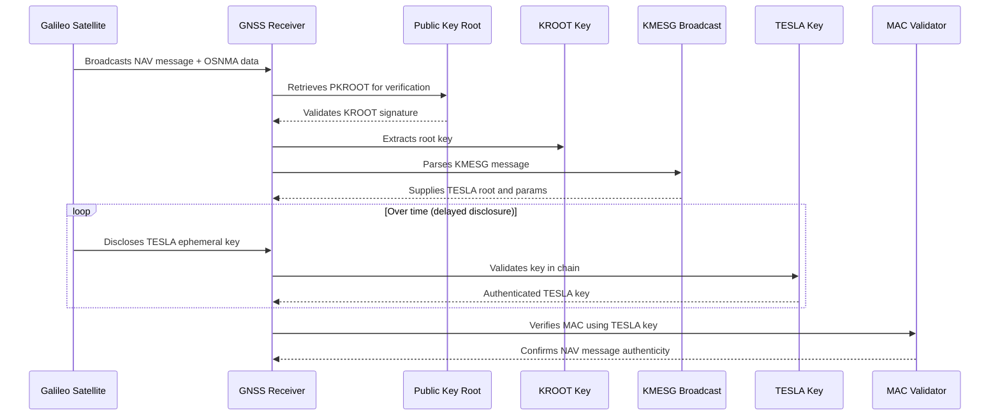

# 📶 UML Sequence Diagram: OSNMA Authentication Flow

This diagram models the time-sequenced interaction for authenticating navigation messages using OSNMA as described in the [Galileo OSNMA scheme diagram](https://www.gsc-europa.eu/sites/default/files/sites/all/files/OSNMA_scheme.png).

---

## 🧭 Description

| Actor     | Role |
|-----------|------|
| `Satellite` | Transmits navigation messages and OSNMA data |
| `Receiver` | GNSS client device collecting and verifying data |
| `PKROOT` | Trusted public key anchor |
| `KROOT` | Intermediate key signed by PKROOT |
| `KMESG` | Message containing TESLA root key and params |
| `TESLA` | Key disclosure mechanism used for MAC authentication |
| `MAC` | Verifies the integrity of the navigation message |

---

## 🌐 Reference

- [Galileo OSNMA Scheme Diagram (GSC)](https://www.gsc-europa.eu/sites/default/files/sites/all/files/OSNMA_scheme.png)

---

## 🔍 How OSNMA Works in PIC2BIM-iOS

The `PIC2BIM-iOS` application integrates OSNMA support by:

1. **Capturing Galileo E1B Signals**: 
   - The app uses iOS GNSS APIs or external GNSS hardware to capture raw GNSS data, including navigation messages from Galileo satellites.

2. **Decoding OSNMA Data**:
   - OSNMA fields embedded in the E1B message are parsed by custom logic (e.g., within a module like `PublicKeyManager.swift`).
   - The KMESG provides parameters including the root key for the TESLA key chain.

3. **Public Key Validation**:
   - The app retrieves a trusted PKROOT (Public Key Root) from a built-in certificate or trusted repository.
   - It verifies the KROOT using this PKROOT to ensure the root of trust is valid.

4. **TESLA Ephemeral Key Chain Management**:
   - The disclosed TESLA keys are checked against the expected key chain to ensure their authenticity.
   - TESLA keys are then used to validate the MAC (Message Authentication Code) on the navigation message.

5. **Navigation Message Authentication**:
   - If MAC verification succeeds, the satellite data is considered OSNMA-authenticated.
   - Authenticated satellite IDs are stored and tagged in GNSS metadata.

6. **Trusted Position Tagging**:
   - The application associates validated satellite data with captured images or field logs.
   - The user is notified of trusted positioning via the UI (e.g., camera overlay or photo logs).

This layered OSNMA validation pipeline strengthens the authenticity and reliability of location-tagged data collected in the field using the PIC2BIM iOS app.

---

## 📦 Key Benefits in PIC2BIM-iOS

- Enhances **GNSS trust** for asset verification and field documentation.
- Mitigates risks of GNSS spoofing or manipulation.
- Ensures **cryptographically validated** positioning data for regulated workflows.

