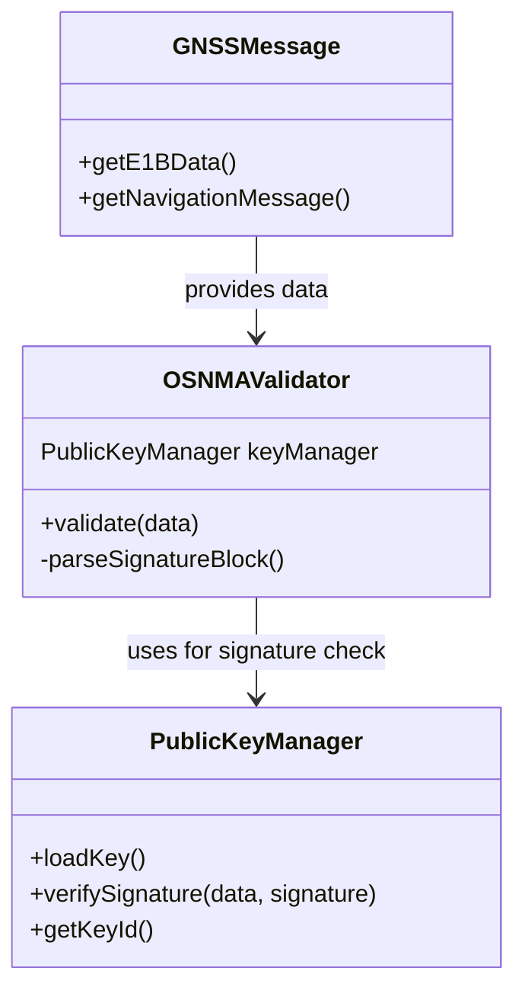

# 🔐 UML Class Diagram: PublicKey in PIC2BIM iOS

This class diagram illustrates how the `PublicKey` functionality might be structured and interact with other components for OSNMA in the PIC2BIM iOS app.

---

## 🧩 Mermaid Class Diagram

---

## ✅ Summary

- **PublicKeyManager**: Handles key management and signature verification for OSNMA.
- **OSNMAValidator**: Uses the public key to validate GNSS navigation messages.
- **GNSSMessage**: Supplies raw satellite message data to the validator.

This modular design supports secure, validated location data handling in offline or online modes.

