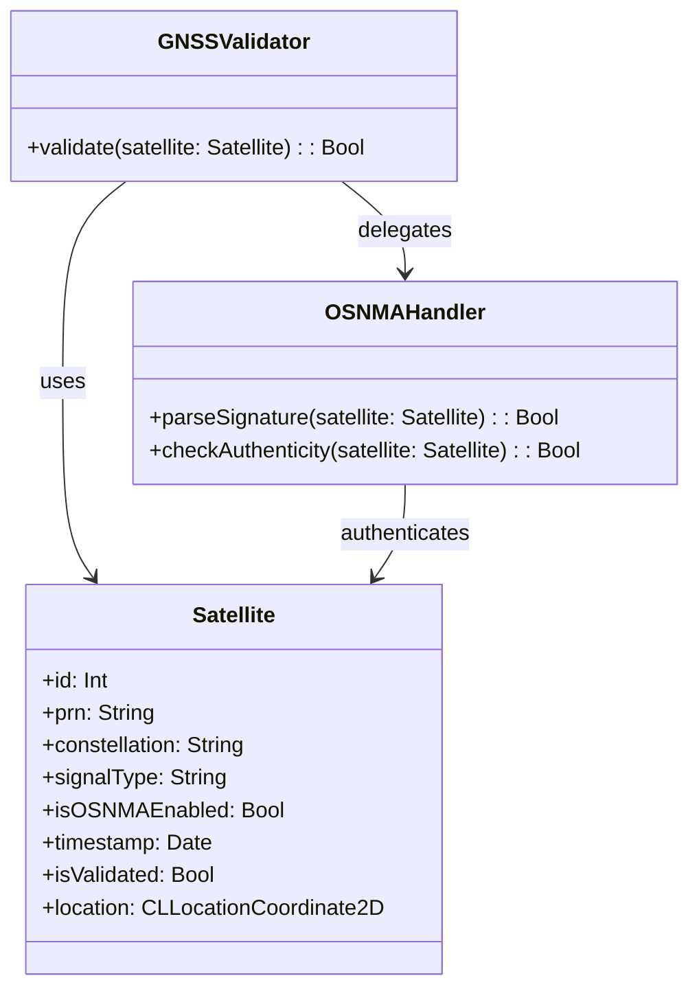

# 🛰️ UML Class Diagram: SatelliteID in PIC2BIM iOS

This diagram represents the conceptual structure of the `SatelliteID` class and its relationships in the PIC2BIM iOS application.

---

## 🧩 Mermaid Class Diagram

---

## ✅ Summary

- **Satellite**: Represents each GNSS satellite with ID, PRN, and validation info.
- **GNSSValidator**: Checks satellite trustworthiness using OSNMA.
- **OSNMAHandler**: Handles parsing and signature verification.

This structure supports navigation authentication workflows and geospatial data validation in the app.

