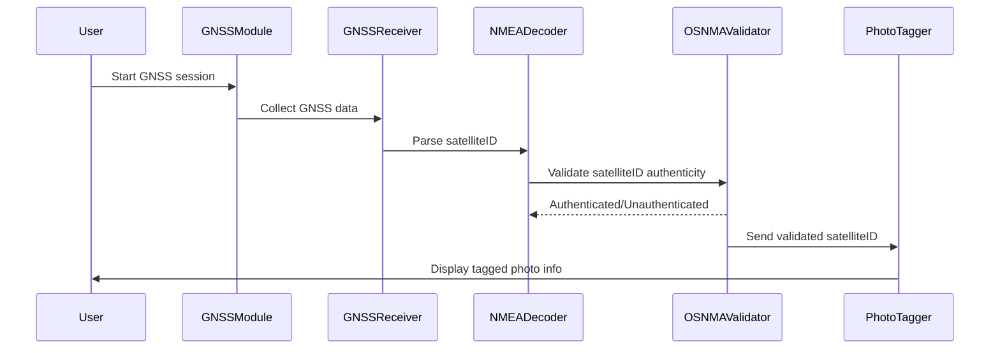

# 🛰️ UML Sequence Diagram: `satelliteID` Processing in PIC2BIM iOS

This diagram represents the flow of data and actions related to handling the `satelliteID` within the PIC2BIM iOS application.

---

## 🧩 Mermaid Sequence Diagram

---

## ✅ Summary

- The `satelliteID` is captured and decoded from GNSS signals.
- OSNMA validation ensures the identity and integrity of the source satellite.
- The verified `satelliteID` is associated with captured photos for geospatial trust.
- This supports use cases requiring verifiable positioning data.

