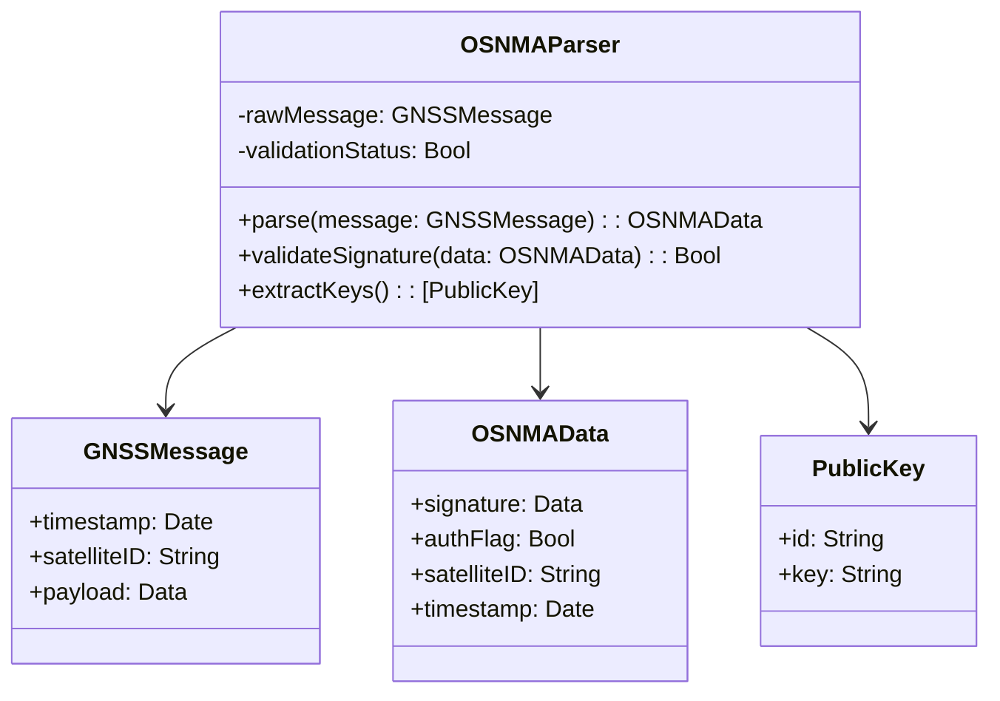

# 📘 UML Class Diagram: `OSNMAParser` in PIC2BIM iOS

This class diagram represents the structure and relationships of the `OSNMAParser` component assumed to be responsible for parsing Open Service Navigation Message Authentication (OSNMA) data in the PIC2BIM iOS app.

---

## 🧩 Mermaid Class Diagram

---

## ✅ Summary

- **OSNMAParser** acts as the main parser and validator for GNSS messages using OSNMA.
- It relies on `GNSSMessage` as input and generates `OSNMAData` for validation.
- **PublicKey** entities are used for signature verification.
- This modular design supports maintainable and secure authentication workflows in the app.

