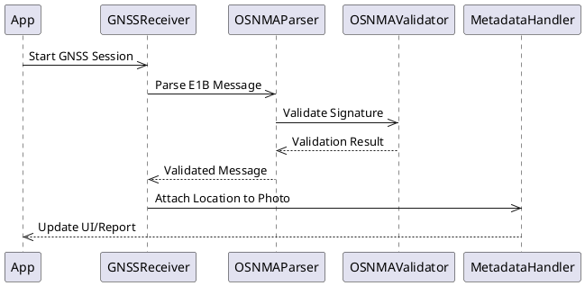

# 🔄 UML Sequence Diagram: OSNMAParser in PIC2BIM iOS

This sequence diagram outlines the flow of operations for parsing and validating OSNMA (Open Service Navigation Message Authentication) messages using the `OSNMAParser` component in the PIC2BIM iOS application.

---

## 🧩 UML Sequence Diagram

---

## ✅ Summary

- The `App` initiates a GNSS session which leads to data capture by `GNSSReceiver`.
- `OSNMAParser` extracts message content from Galileo E1B signals.
- `OSNMAValidator` performs cryptographic checks to authenticate the messages.
- Upon validation, metadata is generated and passed to the UI and reporting layers.

