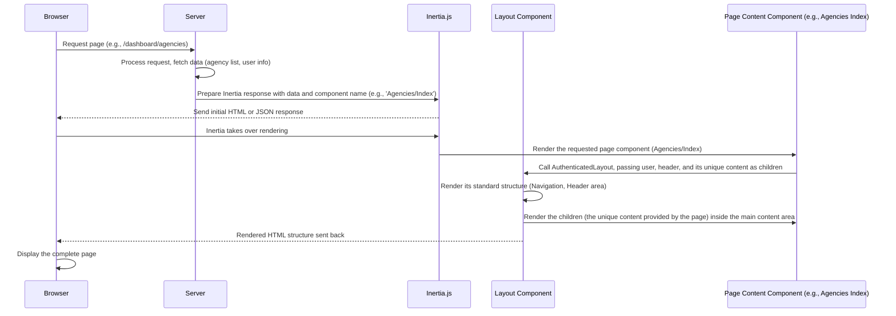

# Chapter 1: Authenticated Layout

Welcome to the first chapter of our tutorial series for the `code_to_analyze` project! We're going to start by understanding a core building block for many pages in this application: the **Authenticated Layout**.

### Why do we need a Layout?

Imagine you're building a house. Every room might have different furniture and serve a unique purpose (a bedroom, a kitchen, etc.). But they all share common things: walls, a roof, and a foundation. It would be a lot of extra work to build the walls and roof *separately* for *every single room*, right? Instead, you build the main structure (the layout of the house), and then fill in the rooms.

In web applications, many pages share common elements:
*   A navigation bar at the top.
*   Maybe a sidebar on the left or right.
*   A consistent background color or styling.
*   Information about the currently logged-in user displayed somewhere.

Look at these files from our project:
*   `resources/js/Pages/Agencies/Index.tsx`
*   `resources/js/Pages/TaskType/Index.tsx`
*   `resources/js/Pages/Users/Unassigned.tsx`

If you quickly scan these files, you'll notice they all seem to render a table or some main content, but they also share a similar overall look (header, navigation, etc.). Building that common structure individually for each page would be repetitive and hard to maintain. If you wanted to change the navigation bar, you'd have to edit dozens of files!

This is where the **Authenticated Layout** comes in.

### What is the Authenticated Layout?

Think of the Authenticated Layout as the *standard frame* for pages that require a user to be logged in. Just like a picture frame provides borders and a backing for a photo, the Authenticated Layout provides the standard structure (navigation, header area, main content area) for your page's unique content.

It's a reusable component that wraps around the specific part of your page that changes.

### How Pages Use the Authenticated Layout

Let's look at a simplified example based on the `resources/js/Pages/Agencies/Index.tsx` file.

```typescript
import AuthenticatedLayout from '@/Layouts/AuthenticatedLayout';
import {Head, Link, usePage, router} from '@inertiajs/react';
// ... other imports ...

export default function Dashboard({ auth }: PageProps) {
  // ... page logic ...

  return (
    <AuthenticatedLayout
      user={auth.user}
      header={<h2 className="font-semibold text-xl text-gray-800 dark:text-gray-200 leading-tight">Agency management</h2>}
    >
      {/* This is where the *specific content* for this page goes */}
      <Head title="Agency Management" />

      <div className="py-12">
        <div className="max-w mx-auto sm:px-6 lg:px-8">
          <div className="bg-white dark:bg-gray-800 overflow-hidden shadow-sm sm:rounded-lg">
            {/* ... Page-specific elements like the "Add New Agency" button and the Table ... */}
            {/* The AuthenticatedLayout component will render all this content */}
            {/* inside its main content area. */}
          </div>
        </div>
      </div>
    </AuthenticatedLayout>
  );
}
```

**Explanation:**

1.  `import AuthenticatedLayout from '@/Layouts/AuthenticatedLayout';`: This line brings the layout component into our page file.
2.  `<AuthenticatedLayout ...>`: This is where we start using the layout. Everything *inside* the `<AuthenticatedLayout>` tags is the unique content for the "Agencies" page.
3.  `user={auth.user}`: We pass the logged-in user's information to the layout component. This allows the layout to display the user's name in the navigation bar, for example.
4.  `header={<h2 ...>Agency management</h2>}`: The layout has a special area for a page title or header. We pass the desired header element to the `header` prop. The layout component will then render this header in the correct place (usually below the main navigation).
5.  `{/* ... specific content ... */}`: All the JSX elements between the opening and closing `<AuthenticatedLayout>` tags (like the `Head` component, the divs for styling, the Table component) are passed to the `AuthenticatedLayout` component as its `children`.

So, the page component doesn't worry about the navigation bar or the overall page structure. It just provides its *specific content* and the layout wraps it in the consistent frame.

### What Happens When a Page Renders with the Layout?

Let's trace the steps when your browser loads a page that uses the Authenticated Layout:



This sequence shows that your specific page component (`PageContent`) focuses only on its unique task (displaying the table of agencies, in our example). It delegates the job of providing the overall page structure to the `AuthenticatedLayout`.

### Inside the Authenticated Layout (Simplified)

The `AuthenticatedLayout` itself is a React component defined in `resources/js/Layouts/AuthenticatedLayout.tsx`. It's responsible for rendering the actual HTML structure of the layout.

Let's look at a heavily simplified version of its code:

```typescript
// Simplified version of resources/js/Layouts/AuthenticatedLayout.tsx
import { PropsWithChildren, ReactNode } from "react";
// Imagine other imports for NavLink, Dropdown, etc.

export default function Authenticated({
    user,
    header,
    children, // This prop holds the content from your page!
}: PropsWithChildren<{
    user: any; // Simplified type for tutorial
    header?: ReactNode;
}>) {

    // ... state and functions for navigation, theme toggle, etc. (complex logic omitted for clarity)

    return (
        <div className="min-h-screen bg-gray-100 dark:bg-gray-900">
            {/* --- Top Navigation Bar --- */}
            <nav className="bg-white dark:bg-gray-800 border-b border-gray-100 dark:border-gray-700">
                <div className="max-w-7xl mx-auto px-4 sm:px-6 lg:px-8">
                    <div className="flex justify-between h-16">
                        {/* Application Logo & Core Nav Links */}
                        <div className="flex items-center">
                           {/* <Link href="/">...Logo...</Link> */}
                           {/* <NavLink href={route("dashboard")} ...>Home</NavLink> */}
                           {/* ... other conditional NavLinks based on user roles ... */}
                        </div>

                        {/* User Dropdown & Theme Toggle */}
                        <div className="hidden sm:flex sm:items-center sm:ms-6">
                           {/* ... SplitView Toggle (if present) ... */}
                           {/* ... User Dropdown with Profile/Logout links ... */}
                           {/* ... Theme Toggle Button ... */}
                        </div>

                        {/* Mobile Menu Button */}
                        <div className="-me-2 flex items-center sm:hidden">
                           {/* ... Mobile Menu Toggle ... */}
                        </div>
                    </div>
                </div>

                {/* Responsive Navigation Links (for mobile) */}
                {/* <div className={(showingNavigationDropdown ? "block" : "hidden") + " sm:hidden"}> */}
                    {/* ... Responsive NavLinks ... */}
                    {/* ... Responsive User Info/Links ... */}
                {/* </div> */}
            </nav>

            {/* --- Page Header Area (if header prop is provided) --- */}
            {header && (
                <header className="bg-white dark:bg-gray-800 shadow">
                    <div className="max-w-7xl mx-auto py-6 px-4 sm:px-6 lg:px-8">
                        {/* This is where the content from the 'header' prop is rendered */}
                        {header}
                    </div>
                </header>
            )}

            {/* --- Main Content Area --- */}
            <main>
                {/* This is where the content placed INSIDE <AuthenticatedLayout>...</AuthenticatedLayout> tags is rendered */}
                {children}
            </main>
        </div>
    );
}
```

**Explanation:**

*   The component receives `user`, `header`, and `children` as props.
*   It renders the HTML structure for the navigation bar (`<nav>`). Inside this nav, it would contain logic to show links (like "Home", "Unassigned Farmers", etc., potentially based on the `user`'s roles) and controls (like the user dropdown and theme toggle).
*   It checks if the `header` prop exists (`{header && (<header>...</header>)}`). If you provided a header element when using the layout (like `<h2 ...>Agency management</h2>`), it renders a header section and places that element inside it.
*   Most importantly, it includes `<main>{children}</main>`. The `children` prop automatically contains everything you placed *inside* the `<AuthenticatedLayout>` tags back in your page component (like the `Head` tag and the divs holding the table). By putting `{children}` here, the layout component renders *your page's specific content* within the main content area of the layout frame.

This shows how the Authenticated Layout is a wrapper that provides the consistent outer shell, and your page component provides the unique inner content (`children`) and potentially a title for the header area (`header`).

### Conclusion

In this chapter, we learned about the **Authenticated Layout** component. We saw that it provides a consistent look and feel for pages that require a user to be logged in, handling common elements like the navigation bar and header area. Pages like Agency Management or User Management simply wrap their unique content inside this layout, passing necessary information like the current user and the desired page title. This approach makes the application easier to build and maintain.

Next, we'll dive deeper into how these individual pages, wrapped by the layout, are structured in this project, introducing [Inertia.js Page Structure](02_inertia_js_page_structure_.md).

---

Generated by [AI Codebase Knowledge Builder](https://github.com/The-Pocket/Tutorial-Codebase-Knowledge)