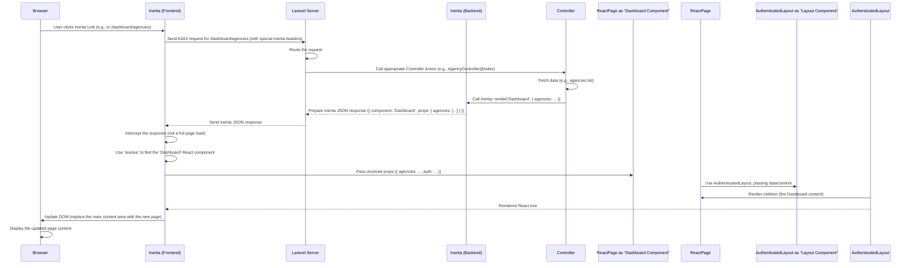

# Chapter 2: Inertia.js Page Structure

Welcome back! In [Chapter 1: Authenticated Layout](01_authenticated_layout_.md), we learned how the Authenticated Layout provides the consistent frame for pages requiring a logged-in user. We saw how individual pages provide their specific content and place it *inside* that layout frame.

But how does the server decide *which* specific page content (like the Agencies list or the Photo Gallery) to send to the browser in the first place? And how does that content, which is written in React, receive the data it needs (like the list of agencies or photos)?

This is where **Inertia.js** comes in.

### Inertia.js: The Smart Messenger Service

Imagine your browser asks the server for a specific "page," like the list of agencies.

*   **Traditional Web App:** The server would build the *entire* HTML page from scratch, including the navigation, the header, the agency table, footers, etc., and send that big HTML file to the browser. The browser then discards the old page and loads the new one completely. This can feel slow, like waiting for a whole new website to load for every click.
*   **Traditional Single-Page App (SPA) with API:** The server would only send *data* (like the list of agencies) via a separate API endpoint. The browser would then use JavaScript (React, Vue, etc.) to figure out which React component to show, fetch the data from the API, and build the page *entirely* on the client-side. This is fast for navigation but requires building a full API on the server and complex client-side routing.

Inertia.js offers a different approach. Think of Inertia as a **smart messenger service** between your Laravel backend and your React frontend.

Instead of sending a whole new HTML page or just raw API data, the server uses Inertia to send a small, specific package:

1.  The **name** of the React component that should handle this "page" (e.g., `Pages/Agencies/Index`).
2.  All the **data** that component needs to render itself (e.g., the list of agencies, user info).

When the browser receives this package, Inertia's client-side adapter intercepts it. It then tells your React application: "Okay, I received the package for the `Pages/Agencies/Index` component, and here is the data it needs. Render it!"

This means:
*   You write your "pages" as standard React components.
*   Controllers on the server *render* these components directly, passing data as props.
*   Subsequent page visits are fast because Inertia only fetches the necessary data and swaps out the main content area, not the whole page (like a mini-SPA navigation).

It's like the smart messenger only brings the *new furniture* for the room you're visiting, not a whole new house, but he also tells the house frame where to put the furniture!

### Pages are Just React Components

In an Inertia application like `code_to_analyze`, the "pages" you see are simply React components located inside the `resources/js/Pages` directory.

Look at these files again:
*   `resources/js/Pages/Agencies/Index.tsx` (or the similar `resources/js/Pages/Dashboard.tsx` showing agencies)
*   `resources/js/Pages/Farmers/PhotoGallery.tsx`
*   `resources/js/Pages/Farmers/Index.tsx` (Task list)

Each of these `.tsx` files defines a React component that represents a specific view or "page" in your application.

### How a Controller Renders an Inertia Page

On the server-side (in Laravel), you don't return a traditional view. Instead, you use Inertia's `render` method.

Let's imagine a simple controller action for the Agencies page. While the exact controller isn't in the provided code snippets, here's what a typical Inertia controller action might look like in Laravel:

```php
// Simplified Laravel Controller Action (Imagine this is in a file like App\Http\Controllers\AgencyController.php)

use Inertia\Inertia;
use App\Models\Agency;
// ... other imports ...

public function index()
{
    // 1. Fetch data needed for the page
    $agencies = Agency::paginate(); // Get a paginated list of agencies

    // 2. Use Inertia::render() to send the component name and data
    return Inertia::render('Dashboard', [ // 'Dashboard' is the name of the React page component file in resources/js/Pages/
        'agencies' => $agencies, // Pass the agencies data as a prop named 'agencies'
    ]);
}
```

**Explanation:**

1.  We fetch any data the page needs from the database (here, a list of `$agencies`).
2.  `Inertia::render('Dashboard', [...])` is the key part.
    *   The first argument (`'Dashboard'`) tells Inertia which React component to load on the frontend. Inertia automatically looks for a file named `resources/js/Pages/Dashboard.tsx` (or `.jsx`, `.vue`, etc. depending on your frontend framework).
    *   The second argument is an array of data. Each key-value pair in this array becomes a **prop** passed directly to your specified React component. Here, the `$agencies` data is passed as a prop named `agencies`.

This controller action doesn't return HTML; it returns a small JSON response containing the component name and the data props.

### How the React Page Component Receives Data

Now, let's look at the corresponding React page component in `resources/js/Pages/Dashboard.tsx` (using the provided snippet which seems to be the agencies list).

Remember, in React, components receive data through `props`. Inertia makes the data sent from the controller available as props to your page component.

Here's a simplified look at how `Dashboard.tsx` receives and uses the `agencies` data:

```typescript
// Simplified resources/js/Pages/Dashboard.tsx

import AuthenticatedLayout from '@/Layouts/AuthenticatedLayout';
import { Head, usePage } from '@inertiajs/react';
import { PageProps, PaginatedData, Agency } from '@/types'; // We'll cover types later!
import Table from "@/Components/Table/Table"; // Using a component from Chapter 6

// The component receives props, including standard Inertia props like 'auth'
// and custom props sent from the controller, like 'agencies'.
export default function Dashboard({ auth }: PageProps) {

  // Inertia provides a hook `usePage` to access the page props.
  // We use it here to get the 'agencies' prop sent by the controller.
  const { agencies } = usePage<{
    agencies: PaginatedData<Agency>; // Tells TypeScript the shape of 'agencies'
  }>().props;

  // The 'agencies' prop contains the actual data fetched by the controller.
  const { data, links } = agencies; // Extract the list of items and pagination links

  return (
    // The layout component from Chapter 1 wraps the page content
    <AuthenticatedLayout
      user={auth.user}
      header={<h2 /* ... */ >Agencies</h2>}
    >
      <Head title="Agency Management" />

      {/* The unique content of THIS page */}
      <div>
        {/* ... Add New Agency Button ... */}

        {/* Pass the received agency data to the Table component */}
        <Table
          columns={[ /* ... column definitions ... */ ]}
          rows={data} // Pass the actual agency items here
        />

        {/* ... Pagination links using 'links' ... */}
      </div>
    </AuthenticatedLayout>
  );
}
```

**Explanation:**

1.  The `Dashboard` component is exported as the default. This is the component Inertia will try to render when the controller specifies `'Dashboard'`.
2.  It imports `AuthenticatedLayout` (from [Chapter 1: Authenticated Layout](01_authenticated_layout_.md)) because this page uses that standard layout.
3.  `usePage().props` is a hook provided by Inertia React. It gives you access to *all* the props that the server sent when rendering this page.
4.  We destructure `{ agencies }` from `usePage().props` to extract the `agencies` data that the controller passed. We also use TypeScript types here (`PaginatedData<Agency>`) which we'll explain in [Chapter 4: Application Data Types (TypeScript)](04_application_data_types__typescript__.md).
5.  The component then uses this `agencies` data (specifically `agencies.data`) when rendering the `<Table>` component (which we'll explore in [Chapter 6: Data Table Component](06_data_table_component_.md)).

So, the flow is:

*   **Server:** Fetches data -> `Inertia::render()` with component name and data props.
*   **Inertia Frontend:** Receives response -> Finds the specified React component -> Passes the received data as props to that component.
*   **React Component:** Receives props -> Uses the data (e.g., loops through a list to display items) -> Renders itself, often wrapped in a Layout component.

### The Inertia.js Frontend Adapter (`app.tsx`)

You might wonder, how does Inertia on the frontend *find* the right React component based on the name the server sends?

This is handled by the main `resources/js/app.tsx` file. This file is the entry point for your frontend application and sets up Inertia.

Let's look at a relevant part of `resources/js/app.tsx`:

```typescript
// Snippet from resources/js/app.tsx

import { createRoot, hydrateRoot } from 'react-dom/client';
import { createInertiaApp } from '@inertiajs/react';
import { resolvePageComponent } from 'laravel-vite-plugin/inertia-helpers';

const appName = import.meta.env.VITE_APP_NAME || 'Laravel';

createInertiaApp({
    title: (title) => `${title}`,
    // This 'resolve' function tells Inertia how to find your page components.
    resolve: (name) => resolvePageComponent(`./Pages/${name}.tsx`, import.meta.glob('./Pages/**/*.tsx')),
    setup({ el, App, props }) {
        // This function runs when Inertia is ready to render a page
        if (import.meta.env.DEV) {
            createRoot(el).render(<App {...props} />); // For development
        } else {
            hydrateRoot(el, <App {...props} />); // For production (for SEO/speed benefits)
        }
    },
    // ... progress indicator options ...
});
```

**Explanation:**

1.  `createInertiaApp({...})` initializes Inertia on the frontend.
2.  The `resolve` function is crucial. Inertia calls this function, passing the `name` of the component the server specified (e.g., `'Dashboard'`).
3.  `resolvePageComponent(`./Pages/${name}.tsx`, import.meta.glob('./Pages/**/*.tsx'))` is a helper function (provided by Laravel Vite plugin) that dynamically finds the correct `.tsx` file within the `resources/js/Pages` directory based on the provided `name`. So, if `name` is `'Dashboard'`, it finds `resources/js/Pages/Dashboard.tsx`. If `name` is `'Agencies/Index'`, it finds `resources/js/Pages/Agencies/Index.tsx`, and so on.
4.  The `setup` function is called when a page needs to be rendered. It receives the root DOM element (`el`), the main Inertia App component (`App`), and the page `props` (which include all the data sent from the controller, like `auth` and `agencies`). It then uses `createRoot` or `hydrateRoot` to render the main `<App>` component into the DOM, passing the received `props`. The `<App>` component itself then uses the `resolve` function internally to figure out *which* specific page component (`Dashboard`, `PhotoGallery`, etc.) to render based on the props, and passes the data props down to *that* component.

### What Happens When You Navigate (Sequence Diagram)

Let's visualize the process when you click an Inertia link to navigate from one page (e.g., Home) to another (e.g., Agencies):



Notice that subsequent navigation via Inertia links (`<Link href="...">` in React) uses AJAX and only swaps the main content area, resulting in a faster, SPA-like feel compared to full page reloads.

### Conclusion

In this chapter, we explored the core concept of Inertia.js page structure. We learned that instead of traditional server-rendered HTML or complex client-side SPAs, Inertia allows Laravel controllers to render React components directly as "pages," passing necessary data as props. This data is then available to your React page components via the `usePage` hook. We saw how the frontend adapter (`app.tsx`) connects the component name from the server to the actual React component file.

This simple yet powerful approach provides a great developer experience, letting you build modern single-page applications using familiar server-side routing and controllers, while leveraging the power of React components on the frontend.

Now that you understand how Inertia delivers pages and data, the next step is to dive deeper into the building blocks of your frontend: [React Components](03_react_components_.md).

---

Generated by [AI Codebase Knowledge Builder](https://github.com/The-Pocket/Tutorial-Codebase-Knowledge)