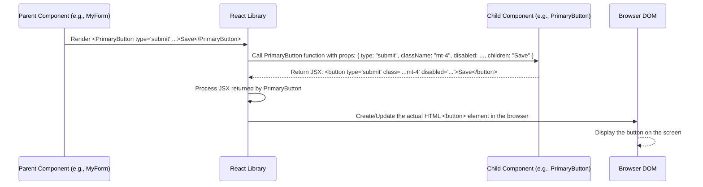

# Chapter 3: React Components

Welcome back! In the previous chapter, [Chapter 2: Inertia.js Page Structure](02_inertia_js_page_structure_.md), we saw how Inertia.js helps bridge the gap between our Laravel backend and React frontend. It sends the name of a React "page" component (like `Dashboard.tsx`) and the data it needs, and the Inertia frontend adapter loads and renders that component.

But when you look at a page like the Dashboard, you don't just see one big block of code. You see smaller pieces: buttons, input fields, maybe sections for charts or lists. If you were to build the *entire* page's user interface as one massive chunk of code inside `Dashboard.tsx`, it would quickly become messy, hard to read, and impossible to reuse parts of it elsewhere.

Imagine trying to build a complex structure like a house using only one giant, custom-shaped piece instead of individual bricks. It would be incredibly difficult!

### What Problem Do React Components Solve?

This is where **React Components** come in. They are the fundamental building blocks of a React user interface.

Think of them like **Lego bricks**:

*   Each component is a **self-contained piece** of the UI.
*   It has a **specific purpose** (like a button, a text input, or a section header).
*   It can be **reused** in many different places.
*   You can **combine** simpler components to build more complex ones (like combining small bricks to build a wall section, and then wall sections to build a room).

By breaking down the UI into components, we make our code:

1.  **Easier to understand:** Each file focuses on just one small part of the UI.
2.  **Easier to manage:** Changes to one part of the UI (a component) don't necessarily break other parts.
3.  **Reusable:** Build a button component once, use it everywhere you need a button.

### What is a React Component? (The Basics)

At its simplest, a React component in modern React is often just a **JavaScript function** that returns something React can render, typically **JSX**.

Let's look at a very simple example from the `code_to_analyze` project: `resources/js/Components/ApplicationLogo.tsx`.

```typescript
// resources/js/Components/ApplicationLogo.tsx - Simplified

import { SVGAttributes } from 'react';

export default function ApplicationLogo(props: SVGAttributes<SVGElement>) {
    return (
        <svg /* ... SVG attributes from props */ viewBox="..." xmlns="...">
            {/* ... SVG path data ... */}
        </svg>
    );
}
```

**Explanation:**

*   `export default function ApplicationLogo(...)`: This defines a function component named `ApplicationLogo`. The `export default` makes it available to be imported and used in other files.
*   `props: SVGAttributes<SVGElement>`: The function receives a single argument, `props`. This is an object containing all the properties (like `className`, `width`, `height`, etc.) passed to the component when it's used. The type information (`SVGAttributes<SVGElement>`) tells us what kind of props are expected for an SVG element.
*   `return (<svg> ... </svg>);`: The function returns **JSX**. JSX looks a lot like HTML, but it's actually a way to write UI structures within JavaScript. React takes this JSX and figures out how to render the actual HTML elements in the browser.
*   `{...props}`: This is a common pattern in React. It "spreads" all the properties from the `props` object onto the `<svg>` element. This means if you use `<ApplicationLogo className="logo" width="50" />`, the `className="logo"` and `width="50"` attributes will be applied directly to the rendered `<svg>` tag.

### Using Components (Props)

When you use a component, you pass data and configuration to it using **props**. These are like arguments you pass to a function.

Consider the `PrimaryButton.tsx` component:

```typescript
// resources/js/Components/PrimaryButton.tsx - Simplified

import { ButtonHTMLAttributes } from 'react';

export default function PrimaryButton({ // <-- Destructuring props here
    className = '',
    disabled,
    children, // <-- Special prop for content inside the tags
    ...props // <-- Collect any other standard button props
}: ButtonHTMLAttributes<HTMLButtonElement>) {
    return (
        <button
            {...props} // <-- Apply collected props
            className={`...tailwind classes... ${className}`} // <-- Apply default + custom classes
            disabled={disabled} // <-- Apply disabled state
        >
            {children} {/* <-- Render content passed inside the tags */}
        </button>
    );
}
```

**Explanation:**

*   The component receives props, and we use object destructuring `{ className = '', disabled, children, ...props }` to easily access them.
*   `className`, `disabled`: Standard HTML button attributes passed as props.
*   `children`: This is a **special prop**. In React, whatever you place *between* the opening and closing tags of a component becomes its `children` prop. For example, in `<PrimaryButton>Save</PrimaryButton>`, the text "Save" is the `children` prop. In `<PrimaryButton><PlusIcon /> Add</PrimaryButton>`, both the `<PlusIcon />` component and the text " Add" together form the `children` prop.
*   `...props`: This uses the rest syntax (`...`) to collect any *other* HTML button attributes you might pass (like `type`, `onClick`, `id`, etc.) into a single `props` object.
*   `return (<button> ... </button>);`: It returns a standard `<button>` HTML element.
*   `{...props}`: Applies all the collected extra props to the button.
*   `className="..."`: Sets the CSS classes. It combines some default classes (using Tailwind CSS) with any custom classes passed via the `className` prop.
*   `disabled={disabled}`: Sets the `disabled` attribute based on the `disabled` prop.
*   `{children}`: Renders whatever was passed as the `children` prop *inside* the button tags.

Now, another component (like a form or a page) can easily use this `PrimaryButton`:

```typescript
// Example usage in another component's JSX
import PrimaryButton from '@/Components/PrimaryButton';

function MyForm() {
  // ... form logic ...
  return (
    <div>
      {/* ... other form fields ... */}
      <PrimaryButton
        type="submit"          // Passed via ...props
        className="mt-4"       // Passed as className prop, combined with defaults
        disabled={isSubmitting} // Passed as disabled prop
      >
        Save Changes         {/* Passed as children prop */}
      </PrimaryButton>
    </div>
  );
}
```

This demonstrates how components are reusable and configurable using props. You can create multiple buttons with different text, classes, and behavior by simply passing different props to the same `PrimaryButton` component.

You can see similar patterns in other button components like `SecondaryButton.tsx` and `DangerButton.tsx`, or navigation links like `NavLink.tsx` and `ResponsiveNavLink.tsx` - they all receive props and return slightly different styled HTML elements.

### Composing Components

Just like Lego bricks connect to form larger structures, React components can be nested inside each other. This is called **composition**.

We already saw this in [Chapter 1: Authenticated Layout](01_authenticated_layout_.md) where page components like `Dashboard.tsx` used the `AuthenticatedLayout` component and passed their unique content as `children`:

```typescript
// Simplified Dashboard.tsx using composition
import AuthenticatedLayout from '@/Layouts/AuthenticatedLayout';
import { Head } from '@inertiajs/react';
// Imagine other imports like Table

export default function Dashboard({ auth /* ...other props */}) {
  return (
    {/* Dashboard component uses AuthenticatedLayout */}
    <AuthenticatedLayout
      user={auth.user}
      header={<h2 /* ... */ >Agencies</h2>}
    >
      {/* Everything inside these tags is passed as the 'children' prop */}
      <Head title="Agency Management" />

      <div className="py-12">
        {/* ... other divs for styling ... */}
          {/* Table component is used here */}
          {/* Table component might use other components internally! */}
      </div>
    </AuthenticatedLayout>
  );
}
```

The `AuthenticatedLayout` component then uses the `children` prop to render the `Head` component, the `div`s, and whatever else was inside its tags, in the main content area. The layout component itself also uses other components internally, like `NavLink` for the navigation links or `Dropdown` for the user menu.

Look at `resources/js/Components/Form/FieldGroup.tsx`. This component is designed to wrap form elements like `TextInput` or `SelectInput` to provide a consistent layout for labels and error messages:

```typescript
// resources/js/Components/Form/FieldGroup.tsx - Simplified

interface FieldGroupProps {
  label?: string;
  error?: string;
  children: React.ReactNode; // Can be a single element or multiple
}

export default function FieldGroup({
  label,
  error,
  children // The form input element goes here!
}: FieldGroupProps) {
  return (
    <div className="space-y-2">
      {/* Render the label if provided */}
      {label && (
        <label className="block dark:text-white select-none">
          {label} {/* Use the label prop */}
        </label>
      )}
      
      {/* Render the component(s) placed inside FieldGroup tags */}
      {children} 
      
      {/* Render the error message if provided */}
      {error && <div className="text-red-500 mt-2 text-sm">{error}</div>}
    </div>
  );
}
```

Now, using `FieldGroup` with `TextInput` becomes easy:

```typescript
// Example usage in a form component
import FieldGroup from '@/Components/Form/FieldGroup';
import TextInput from '@/Components/Form/TextInput';

function MyUserForm({ data, errors }) {
  // ... state and handlers ...
  return (
    <div>
      <FieldGroup label="Name" error={errors.name}> {/* Pass label and error via props */}
        {/* The TextInput component is passed as children */}
        <TextInput name="name" value={data.name} onChange={handleChange} />
      </FieldGroup>

      <FieldGroup label="Email" error={errors.email}>
        <TextInput name="email" value={data.email} onChange={handleChange} type="email" />
      </FieldGroup>
      {/* ... other fields ... */}
    </div>
  );
}
```

This is a powerful example of composition. `MyUserForm` doesn't need to know *how* to style a label or an error message; it delegates that to `FieldGroup`. `FieldGroup` doesn't need to know *what kind* of input element it's wrapping; it just renders its `children`. And `TextInput` just focuses on being a well-styled text input. Each component has a single responsibility, making the code much more manageable.

### How React Renders Components (Simplified)

When you use a component like `<PrimaryButton>`, React doesn't just magically make HTML appear. Here's a very simplified view of what happens:



This diagram shows that React acts as a layer between your components and the actual browser display. It calls your component functions, gets the JSX they return, and efficiently updates the browser's HTML (the DOM) to match that JSX.

### Conclusion

In this chapter, we learned that **React Components** are the essential building blocks for building user interfaces in React applications like `code_to_analyze`. They are reusable, self-contained pieces of UI logic and presentation, often defined as simple JavaScript functions returning JSX. We saw how data and configuration are passed into components using **props**, and how components are nested together through **composition** to build complex UIs from simpler parts. Understanding components and how to compose them is key to navigating and modifying the `code_to_analyze` frontend code.

Next, we'll explore how the application defines the structure and types of the data that flows through these components, in [Chapter 4: Application Data Types (TypeScript)](04_application_data_types__typescript__.md).

---

Generated by [AI Codebase Knowledge Builder](https://github.com/The-Pocket/Tutorial-Codebase-Knowledge)