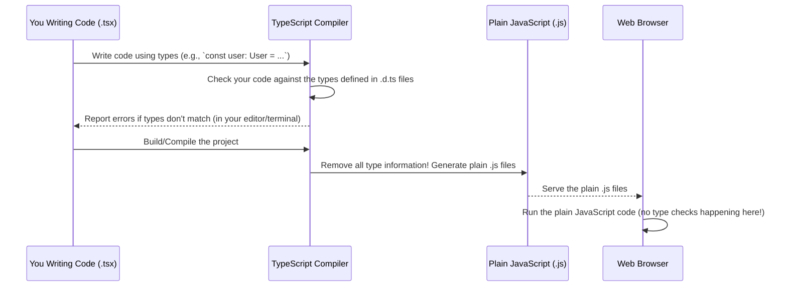

# Chapter 4: Application Data Types (TypeScript)

Welcome back! In the last two chapters, we built a foundation for understanding the frontend of `code_to_analyze`. In [Chapter 2: Inertia.js Page Structure](02_inertia_js_page_structure_.md), we saw how Laravel sends data to our React page components using Inertia. In [Chapter 3: React Components](03_react_components_.md), we learned how to build user interfaces by combining smaller, reusable components.

These components receive data (like a list of Tasks or a single User's details) as `props`. But how does a component know exactly what kind of information to expect in those props? If a component is supposed to display a user's name and email, what happens if the data it receives has a property called `fullName` instead of `name`, or if the email is missing?

In plain JavaScript, you might not find out about these issues until you run the code in the browser, which can lead to unexpected errors or blank parts of the page.

### The Problem: Unsure Data Shapes

Imagine you have a simple component that displays a user's information:

```javascript
// Simple JavaScript component (no types)
function UserInfo({ userData }) {
  // We EXPECT userData to have 'name' and 'email'
  return (
    <div>
      <h2>User: {userData.name}</h2> {/* What if userData.name is missing? */}
      <p>Email: {userData.email}</p> {/* What if userData.email is undefined? */}
    </div>
  );
}

// Usage 1: Works as expected
<UserInfo userData={{ name: 'Alice', email: 'alice@example.com' }} />

// Usage 2: PROBLEM! The prop name is wrong.
<UserInfo userData={{ fullName: 'Bob', emailAddress: 'bob@example.com' }} /> // This will likely cause errors!
```

In the second usage example, the `UserInfo` component is expecting `userData.name` and `userData.email`, but it receives `{ fullName: 'Bob', emailAddress: 'bob@example.com' }`. When React tries to render `userData.name` (which is `undefined`), it might display nothing or throw an error.

This becomes especially tricky when data comes from a backend API (like our Laravel application). You need a clear understanding of the *contract* or *blueprint* for the data being sent.

### The Solution: TypeScript Interfaces (Blueprints!)

This is where **Application Data Types** using **TypeScript Interfaces** save the day!

Think of a TypeScript interface as a **detailed blueprint** or a **contract** that defines the exact shape of an object. It specifies what properties an object *must* have, what types those properties should be (like string, number, boolean, array), and whether they are optional.

```typescript
// Blueprint for a User object
interface User {
  id: number; // User object must have an 'id' which is a number
  login: string; // Must have a 'login' which is a string
  name: string; // Must have a 'name' which is a string
  email: string; // Must have an 'email' which is a string
  email_verified_at: string | null; // Can have 'email_verified_at' which is string or null
  roles: Array<Role>; // Must have 'roles' which is an array of Role objects (we need a blueprint for Role too!)
  // ... potentially other properties ...
}
```

Now, when you write a component that uses `userData`, you can tell TypeScript: "Hey, this `userData` prop *will* conform to the `User` blueprint!"

```typescript
// TypeScript component using the User interface
import { User } from '@/types'; // Import the User blueprint

interface UserInfoProps {
  userData: User; // Declare that userData MUST match the User interface
}

function UserInfo({ userData }: UserInfoProps) {
  // TypeScript KNOWS userData has 'name' and 'email'
  return (
    <div>
      <h2>User: {userData.name}</h2>
      <p>Email: {userData.email}</p>
      {/* TypeScript would give an error here if you typed userData.fullName */}
      {/* <p>Full Name: {userData.fullName}</p> */}
    </div>
  );
}

// Usage 1: Works as expected
<UserInfo userData={{ id: 1, login: 'alice', name: 'Alice', email: 'alice@example.com', email_verified_at: null, roles: [] }} />

// Usage 2: PROBLEM! TypeScript will show an error AS YOU TYPE THE CODE!
// <UserInfo userData={{ fullName: 'Bob', emailAddress: 'bob@example.com' }} /> // TypeScript error: Type... is not assignable to type 'User'
```

By declaring the `userData` prop's type as `User`, TypeScript checks if the object you pass actually matches the `User` blueprint. If it doesn't (like in the second usage example), TypeScript will immediately show you an error in your code editor *before* you even run the application. This catches many potential bugs early!

### Where Are These Blueprints Defined? (`index.d.ts`)

In the `code_to_analyze` project, these data blueprints (interfaces) are primarily defined in the **`resources/js/types/index.d.ts`** file. The `.d.ts` extension stands for "declaration" file. These files *only* contain type definitions and don't compile into actual JavaScript code. They are purely for TypeScript to understand the structure of your data and code.

Let's look at some key blueprints from `resources/js/types/index.d.ts`.

#### The User Blueprint

As we saw, the `User` interface defines the structure of a user object:

```typescript
// Simplified snippet from resources/js/types/index.d.ts
export interface User {
  id: number;
  login: string;
  name: string;
  surname: string;
  email: string;
  identification_number: string;
  vat: string;
  email_verified_at: string | null;
  roles : Array<Role>; // Uses another blueprint: Role
}

export interface Role {
  id : number;
  role_id : number; // The actual role ID (e.g., 1 for Admin, 2 for Inspector)
  user_id : number; // Which user this role belongs to
}
```

This tells us that any object we expect to be a `User` must have all these properties with the specified types. `email_verified_at` can be a string or `null`. `roles` must be an array of objects that match the `Role` blueprint.

#### The Task Blueprints

Tasks are central to the application. There are a few related blueprints for tasks:

```typescript
// Simplified snippet from resources/js/types/index.d.ts
export interface Task {
  id?:number; // The '?' means this property is optional (might not be present sometimes)
  status?: string;
  photo_taken?: number;
  name?: string;
  text?: string; // Description
  note?: string;
  date_created?: string;
  task_due_date?: string;
  flag_valid?: string;
  flag_deleted?:number;
  text_reason?:string;
  text_returned?:string;
  timestamp?:string;
  user_id?:number;
  flag_id?:number // Links to acceptance flag
}

// Sometimes a Task object might also include its associated photos directly
export interface Tasks extends Task { // 'extends Task' means Tasks has all properties of Task PLUS anything defined here
  photos: Array<Photo>; // An array of Photo objects (needs a Photo blueprint!)
}

// When showing a list of tasks with photos for map viewing
export interface TaskPhotos extends Task {
  photo: Photo; // A single associated Photo object
  farmer_name: string; // Denormalized farmer name
  location: [number, number]|any; // Latitude/longitude pair
}

// Blueprint for a Photo object
export interface Photo {
  id: number;
  lat: number; // Latitude
  lng: number; // Longitude
  path: string; // Path to the photo file
  digest: string; // Unique identifier for the photo content
  // ... many other properties for photo metadata (altitude, angle, device info, etc.)
  check: boolean; // Used for frontend selection (e.g., in the Photo Gallery)
  img?: string; // Optional base64 image data or preview URL
  mapImg?: string; // Optional map image preview data
  link?: string; // Optional link to the full image
}
```

These interfaces show how the application structures data related to tasks and photos. `Tasks` builds upon `Task` to include a list of photos, and `TaskPhotos` is a specific structure used for displaying tasks *on a map*, including a single photo and location data, alongside basic task info.

#### The Paginated Data Blueprint (Generics!)

When fetching lists of items from the backend (like lists of agencies, users, or tasks), the data is often "paginated" – meaning it's split into pages (like page 1, page 2, etc.) with links to navigate between them.

```typescript
// Simplified snippet from resources/js/types/index.d.ts
export type PaginatedData<T> = { // <T> is a "Generic" type placeholder!
  data: T[]; // Array of items of type T
  links: PaginationLink[]; // Array of PaginationLink objects
  total : number; // Total number of items overall
};

export interface PaginationLink {
  url: string | null; // URL for the page link (can be null if disabled)
  label: string; // The text for the link ('&laquo; Previous', '1', '2', 'Next &raquo;')
  active: boolean; // Is this the currently active page link?
}
```

The `PaginatedData<T>` interface uses a **Generic type** `<T>`. This is like a placeholder that says, "This blueprint describes paginated data, but the *type of the items* inside the `data` array (`T[]`) can be specified later."

*   If you have a paginated list of `Agency` objects, the type is `PaginatedData<Agency>`.
*   If you have a paginated list of `Tasks` objects (the ones including photos), the type is `PaginatedData<Tasks>`.

This makes the `PaginatedData` interface reusable for lists of *any* type of data in your application.

### Using Data Types in Inertia Pages

Now let's see how these blueprints are used in our React page components that receive data from Inertia.

Recall from [Chapter 2: Inertia.js Page Structure](02_inertia_js_page_structure_.md) that Inertia passes server-side data as props to the page component, and we access them using `usePage().props`.

Look at the `resources/js/Pages/Farmers/Index.tsx` file (the Task list page). It receives a list of tasks.

```typescript
// Snippet from resources/js/Pages/Farmers/Index.tsx
import { PageProps, PaginatedData, Tasks } from "@/types"; // Import the necessary blueprints
import { usePage } from "@inertiajs/react";
// ... other imports ...

export function Index({ auth }: PageProps) {

  // Tell TypeScript exactly what structure the 'tasks' prop has
  const { tasks, sortColumn, sortOrder, search, user, selectedStatuses, errors, filtersVal, splitMode } = usePage<{
      tasks: PaginatedData<Tasks>; // tasks is PaginatedData, and the items in it are of type Tasks
      sortColumn : string;
      sortOrder : 'asc' | 'desc';
      search : string;
      selectedStatuses : string[],
      errors : string[],
      filtersVal : string[],
      splitMode : boolean
    }>().props; // Access all props sent by Inertia

  // TypeScript now knows the shape of the 'tasks' variable
  const { data, total, links } = tasks; // TypeScript knows tasks has 'data', 'total', and 'links'

  // 'data' is known to be Array<Tasks>
  // 'links' is known to be Array<PaginationLink>

  // ... rest of the component logic using 'data' and 'links' ...

  return ( /* ... JSX using the tasks data ... */ );
}
```

**Explanation:**

1.  We import the needed types: `PageProps` (a base type for Inertia page props, defined in `index.d.ts`), `PaginatedData`, and `Tasks`.
2.  When using `usePage()`, we provide a TypeScript *type parameter* (`<{ tasks: PaginatedData<Tasks>; ... }>`) right after the `usePage` function call.
3.  This type parameter is a blueprint for the *expected structure of the `props` object*. It says: "The `props` object should contain a property named `tasks` which conforms to the `PaginatedData<Tasks>` blueprint, and other properties like `sortColumn` (string), `sortOrder` (string), etc."
4.  Because TypeScript now knows the `tasks` variable is `PaginatedData<Tasks>`, it can check our code. If we try to access `tasks.items` instead of `tasks.data`, or if we try to treat `tasks.total` as a string, TypeScript will show an error.
5.  When we destructure `{ data, total, links } = tasks`, TypeScript knows the types of `data` (`Array<Tasks>`), `total` (`number`), and `links` (`Array<PaginationLink>`).

This makes working with data much safer and provides excellent auto-completion and documentation in your code editor.

You can see similar usage in `resources/js/Pages/Farmers/PhotoGallery.tsx`, where `usePage` is used to type the `photos` prop:

```typescript
// Snippet from resources/js/Pages/Farmers/PhotoGallery.tsx
import { PageProps, TaskPhotos, Photo, SplitViewState, Tasks, Task } from "@/types"; // Import types
import { usePage } from "@inertiajs/react";
// ... other imports ...

export function PhotoGallery({ auth, splitMode }: PageProps) {

    // Tell TypeScript the 'photos' prop is an Array of Photo objects
    const { photos } = usePage<{
        photos: Array<Photo>;
    }>().props;

    const [photo_, setPhotos] = useState<Array<Photo>>([]); // Initialize state with the typed data

    // ... loadData function and other logic that expects 'photos' to be Array<Photo> ...

    return ( /* ... JSX using the photos data ... */ );
}
```

Here, the `photos` prop from Inertia is declared as `Array<Photo>`, ensuring that the component handles it correctly.

### Using Data Types for Component Props

We also use these interfaces to define the props that our custom React components expect. This was touched upon in [Chapter 3: React Components](03_react_components_.md).

Look at the `ButtonMap.tsx` component (`resources/js/Components/Map/ButtonMap.tsx`). It needs data to display on the map.

```typescript
// Snippet from resources/js/types/index.d.ts
export interface MapProps{
  data:Array<TaskPhotos>; // Expects an array of TaskPhotos objects
  onClick?:(taskId:number) => void; // Optional click handler
  isSelected?:boolean; // Optional boolean
  isUnassigned?:boolean; // Optional boolean
  paths?:Array<Path>; // Optional array of Path objects
  zoomFilter?:(leaves:Array<String>|undefined) => void; // Optional function prop
  className?:string;
  style?:any
}
```

```typescript
// Snippet from resources/js/Components/Map/ButtonMap.tsx
import { MapProps } from "@/types"; // Import the prop blueprint
// ... other imports ...

export default function ButtonMap({
    data, // TypeScript knows 'data' is Array<TaskPhotos>
    onClick,
    isSelected,
    isUnassigned,
    paths,
    zoomFilter,
    className,
    style
}: MapProps) { // Declare the component's props MUST match MapProps

    // ... component logic using data, onClick, etc. ...
    // Inside here, you can safely access properties like `data[0].photo.lat`
    // because TypeScript knows 'data' holds TaskPhotos objects.

    return ( /* ... JSX rendering the map using 'data' ... */ );
}
```

**Explanation:**

1.  The `MapProps` interface (blueprint) is defined in `resources/js/types/index.d.ts` specifying that the component needs a `data` prop which must be an `Array<TaskPhotos>`.
2.  In `ButtonMap.tsx`, we import `MapProps`.
3.  We declare the component's props like this: `({ data, ...otherProps }: MapProps)`. This tells TypeScript that the object containing all the props must conform to the `MapProps` blueprint.
4.  Now, anywhere inside the `ButtonMap` component function, TypeScript knows the exact shape and types of `data`, `onClick`, `paths`, etc. If you try to pass the wrong type of array to `ButtonMap` when using it elsewhere, TypeScript will give an error.

This provides clear documentation for how to use the `ButtonMap` component and prevents errors caused by passing data in the wrong format.

### Under the Hood: TypeScript is Just for Development/Build

It's important to remember that TypeScript types and interfaces like `User`, `Task`, and `PaginatedData` **do not exist** when your code runs in the browser. TypeScript is a *development tool*.



The TypeScript compiler (part of the build process using Vite in this project) reads your `.tsx` files and the type declarations in `.d.ts` files. It checks for type errors. Then, when it generates the final `.js` files that the browser runs, **all the TypeScript syntax (like `: User` or `<PaginatedData<Tasks>>`) is stripped away.**

This means the blueprints are only used during coding and building to help *you* catch mistakes, but they don't add any size or performance overhead to the code that runs in the user's browser.

### Conclusion

In this chapter, we explored the concept of **Application Data Types** using **TypeScript Interfaces**. We learned that these interfaces act as **blueprints** or **contracts** defining the expected shape and structure of data used throughout the application, especially data received from the backend.

We saw how these types are defined in `resources/js/types/index.d.ts` and how they are used within React page components and other components to provide strong type checking. This helps catch errors early in the development process, makes the code easier to understand, and provides clear documentation for how different parts of the application expect to handle data.

Understanding these data types is crucial because the next chapter will delve into how our application actually fetches and manipulates this data using Inertia, specifically covering [Data Fetching and Forms (Inertia)](05_data_fetching_and_forms__inertia__.md).

---

Generated by [AI Codebase Knowledge Builder](https://github.com/The-Pocket/Tutorial-Codebase-Knowledge)