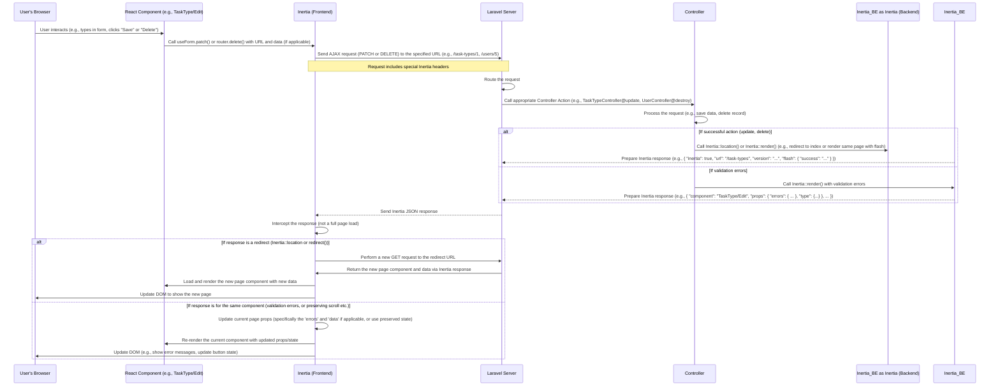

# Chapter 5: Data Fetching and Forms (Inertia)

Welcome back! In our previous chapters, we've built a strong foundation. We saw how the [Authenticated Layout](01_authenticated_layout_.md) provides a consistent frame, how [Inertia.js Page Structure](02_inertia_js_page_structure_.md) allows the server to send specific React components and data, how [React Components](03_react_components_.md) are used to build the UI like Lego bricks, and how [Application Data Types (TypeScript)](04_application_data_types__typescript__.md) help us understand the shape of the data we're working with.

Now, let's put it all together to understand how your React components actually *get* that initial data from the server when a page loads and, importantly, how they *send* data back to the server, for example, when you fill out and submit a form.

Think about the "Edit Task Type" page (`resources/js/Pages/TaskType/Edit.tsx`). When you load this page, the server needs to send the details of the specific Task Type you're editing so the form can be pre-filled. Then, when you click "Save", your browser needs to send the updated details back to the server so they can be saved in the database.

This chapter is about how Inertia helps manage this back-and-forth of data between the frontend and the backend.

### Getting Data When the Page Loads (`usePage`)

We've actually seen this briefly before! When a Laravel controller renders an Inertia page, it passes data as "props".

```php
// Simplified Laravel Controller Action (Imagine this for TaskType Edit)
use Inertia\Inertia;
use App\Models\TaskType;

public function edit(TaskType $taskType)
{
    // 1. Fetch the specific TaskType data
    $taskTypeData = $taskType->load(...); // Load relationships if needed

    // 2. Use Inertia::render() to send the component name and data
    return Inertia::render('TaskType/Edit', [ // 'TaskType/Edit' maps to resources/js/Pages/TaskType/Edit.tsx
        'type' => $taskTypeData, // Pass the TaskType data as a prop named 'type'
    ]);
}
```

In your React page component (`resources/js/Pages/TaskType/Edit.tsx`), you need a way to access this `'type'` prop that the server sent. This is where the **`usePage`** hook from `@inertiajs/react` comes in.

Think of `usePage` as accessing the **pre-filled envelope** that the server (the mailman) delivered when the page first arrived. It contains all the initial data.

Here's how you use it in `resources/js/Pages/TaskType/Edit.tsx`:

```typescript
// Snippet from resources/js/Pages/TaskType/Edit.tsx
import { usePage } from '@inertiajs/react';
import { PageProps, TaskType } from '@/types'; // Import our types from Chapter 4

export function Edit({ auth }: PageProps) {
  // usePage() gives access to the page props sent by Inertia
  // We use TypeScript generics (<{ type: TaskType }>) to tell TypeScript
  // that we expect a 'type' prop, and its shape should match the TaskType blueprint.
  const { type } = usePage<{ type: TaskType }>().props;

  // Now the 'type' variable holds the TaskType object sent from the server
  // You can access its properties like type.name, type.description etc.

  // ... rest of the component logic ...
}
```

**Explanation:**

1.  `import { usePage } from '@inertiajs/react';`: Imports the hook.
2.  `usePage<{ type: TaskType }>().props;`: Calls the hook. The `<{ type: TaskType }>` part is TypeScript telling us the expected structure of the `props` object. We're saying, "Expect a prop named `type` that conforms to the `TaskType` interface (blueprint)." We then access the `props` property returned by the hook.
3.  `const { type } = ...`: We use object destructuring to easily extract the `type` prop from the `props` object.

Now, the `type` variable inside your component holds the actual Task Type data sent by the server (e.g., `{ id: 1, name: 'Initial Visit', description: 'First inspection task' }`). Your component can use this data to, for example, pre-fill the form inputs.

You'll see `usePage().props` used frequently in page components (files in `resources/js/Pages/`) to access the data relevant to that page, like the `users` list in `resources/js/Pages/Users/Index.tsx`:

```typescript
// Snippet from resources/js/Pages/Users/Index.tsx
import { usePage } from '@inertiajs/react';
import { PageProps, PaginatedData, Officer } from '@/types';

export default function Dashboard({ auth }: PageProps) {
  // Getting the paginated list of users and filtering/sorting info
  const { users, sortColumn, sortOrder, search } = usePage<{
    users: PaginatedData<Officer>; // Expecting a paginated list of Officer objects
    sortColumn : string;
    sortOrder : 'asc' | 'desc';
    search : string;
  }>().props;

  // ... rest of the component uses the 'users' variable and other props ...
}
```

This confirms that `usePage` is the standard way to access initial data passed by the server when an Inertia page is loaded.

### Sending Data Back (Forms with `useForm`)

The other side of the coin is sending data *from* the browser *to* the server. The most common way to do this is through **forms**.

When you're editing a Task Type (`resources/js/Pages/TaskType/Edit.tsx`) or updating your profile (`resources/js/Pages/Profile/Partials/UpdateProfileInformationForm.tsx`), you need to:

1.  Keep track of the current values the user has typed into the form fields.
2.  Handle the form submission event (when the user clicks "Save").
3.  Send the collected data to a specific backend route (e.g., `route('types.update', type.id)`).
4.  Handle potential errors returned by the server (e.g., "Name is required").
5.  Indicate that the form is currently being processed (e.g., disable the button).

Managing all this manually with React state and `fetch` or `XMLHttpRequest` can be a bit repetitive. Inertia provides the **`useForm`** hook to simplify this.

Think of `useForm` as a **special notepad and pen** that helps you keep track of everything you're writing in the form and makes it easy to package it up and send it off.

Here's how it's used in `resources/js/Pages/TaskType/Edit.tsx`:

```typescript
// Snippet from resources/js/Pages/TaskType/Edit.tsx
import { useForm } from '@inertiajs/react';
import { TaskType } from '@/types';
import React from 'react'; // Need React for FormEvent type

export function Edit({ auth }: PageProps) {
  const { type } = usePage<{ type: TaskType }>().props; // Get initial data with usePage

  // useForm hook: Manages form state, processing, and errors.
  const { data, setData, errors, patch, processing } = useForm({
    name: type.name || '', // Initialize form state with data from usePage
    description: type.description || '',
  });

  // Function to handle form submission
  function handleSubmit(e: React.FormEvent<HTMLFormElement>) {
    e.preventDefault(); // Prevent the default browser form submission
    // Use the 'patch' method provided by useForm to send the data
    // to the backend route 'types.update', including the type.id
    patch(route('types.update', type.id));
  }

  // ... rest of the component uses data, errors, and processing ...

  return (
    <form onSubmit={handleSubmit}> {/* Attach the handleSubmit function to the form */}
      {/* ... form fields using the 'data' state ... */}
      <FieldGroup required={true} label="Name" name="name" error={errors.name}>
        <TextInput
          name="name"
          error={errors.name} // Show server-side validation errors
          value={data.name} // Bind input value to form state
          onChange={(e) => setData('name', e.target.value)} // Update form state on change
          // ... other props ...
        />
      </FieldGroup>
      {/* ... other fields like description ... */}

      <LoadingButton
        loading={processing} // Disable button while processing
        type="submit"
        // ... other props ...
      >
        Save
      </LoadingButton>
    </form>
    // ... rest of the component ...
  );
}
```

**Explanation:**

1.  `import { useForm } from '@inertiajs/react';`: Imports the hook.
2.  `const { data, setData, errors, patch, processing } = useForm({...});`: This is the core of the hook.
    *   `data`: An object holding the current values of your form fields (`{ name: '...', description: '...' }`).
    *   `setData`: A function to update the `data` object. You typically use it in input `onChange` handlers like `(e) => setData('fieldName', e.target.value)`. You can also use `setData(values => ({...values, fieldName: value}))` for more complex updates or `setData({...data, fieldName: value})`.
    *   `errors`: An object containing any validation errors returned by the server after a submission attempt (`{ name: 'The name field is required.', description: '...' }`).
    *   `patch`: A function to send a `PATCH` request to the server with the current `data`. Inertia forms also provide `post`, `put`, and `delete` methods for other types of requests.
    *   `processing`: A boolean value that is `true` while the form is being submitted and `false` otherwise. Useful for showing loading spinners or disabling the submit button.
3.  `useForm({ name: type.name || '', description: type.description || '' });`: We initialize the `useForm` state with the initial values from the `type` prop fetched by `usePage`.
4.  `handleSubmit`: This function is called when the form is submitted.
    *   `e.preventDefault()`: Stops the browser from doing a standard form submission (which would cause a full page reload). Inertia handles the submission via AJAX.
    *   `patch(route('types.update', type.id))`: Calls the `patch` method to send the form data. `route('types.update', type.id)` is a helper function (provided by the `ziggy-js` package and accessible because of the `ziggy` prop passed by Inertia) that generates the correct URL for the backend update route, including the Task Type ID.
5.  **Binding Inputs:** Inside the JSX, notice how the `TextInput` components are connected to the form state:
    *   `value={data.name}`: The input's value is controlled by the `name` property in the `data` state.
    *   `onChange={(e) => setData('name', e.target.value)}`: Whenever the input's value changes, we update the `name` property in the `data` state using `setData`.
    *   `error={errors.name}`: We pass any server-side validation error for the `name` field to the `TextInput` (or its wrapping `FieldGroup`) so it can be displayed.
6.  **Loading State:** `loading={processing}` on the `LoadingButton` uses the `processing` state from `useForm` to show when the form is being submitted.

This pattern of using `useForm` to manage state (`data`), handle input changes (`setData`), trigger submission (`patch`/`post` etc.), show loading (`processing`), and display errors (`errors`) is fundamental for handling forms in this project. You'll see it in components like `UpdateProfileInformationForm.tsx`, forms for creating new users, agencies, etc.

### Sending Data Back (Non-Form Actions with `router`)

Sometimes you need to send a request to the server that isn't triggered by a form submission, like clicking a "Delete" button. For these actions, you can use the global **`router`** object provided by Inertia.

Think of the `router` object as the **mailman** who can take your requests and bring back the next "envelope" (the next Inertia page response). It's used not only for navigating between pages (like `<Link href="...">` which uses `router.visit` internally) but also for sending specific requests like `DELETE`.

Here's an example from `resources/js/Pages/Users/Index.tsx` where a button triggers a user deactivation (which is a DELETE request in this context):

```typescript
// Snippet from resources/js/Pages/Users/Index.tsx
import { router } from '@inertiajs/react';
import { FontAwesomeIcon } from '@fortawesome/react-fontawesome';
import { faBan } from '@fortawesome/free-solid-svg-icons';

export default function Dashboard({ auth }: PageProps) {
  // ... usePage to get user list ...

  // Function to handle deactivating a user
  function destroy(id: number | string): void {
    // Confirm with the user
    if (confirm('Are you sure with deactivating?')) {
      // Use router.delete() to send a DELETE request
      // to the backend route 'users.destroy' with the user's ID.
      router.delete(route('users.destroy', id));
      // Inertia will handle showing the next page (usually back to the list)
      // and displaying any flash messages (like 'User deactivated successfully').
    }
  }

  // ... rest of the component ...

  return (
    {/* ... Table component rendering user rows ... */}
    {/* Inside the renderCell for Actions column: */}
    <button
      onClick={() => destroy(row.id)} // Call the destroy function when button is clicked
      title='Deactivate'
      // ... styling classes ...
    >
      <FontAwesomeIcon icon={faBan} />
    </button>
    {/* ... other actions ... */}
  );
}
```

**Explanation:**

1.  `import { router } from '@inertiajs/react';`: Imports the global router object.
2.  `destroy(id)` function: This function takes the user ID.
3.  `if (confirm(...))`: A simple JavaScript confirmation dialog.
4.  `router.delete(route('users.destroy', id));`: This is the key line.
    *   `router.delete()`: Tells Inertia to send an AJAX `DELETE` request. Inertia also provides `router.get()`, `router.post()`, `router.put()`.
    *   `route('users.destroy', id)`: Generates the correct URL for the server-side route that handles deleting users.
5.  `onClick={() => destroy(row.id)}`: Attaches the `destroy` function to the button click event, passing the ID of the user for that row.

When `router.delete()` is called, Inertia makes an AJAX request. The server processes the deletion, and then, like with `useForm` submissions, the server returns a *new* Inertia response (usually redirecting back to the user index page with updated data and a success flash message). Inertia on the frontend receives this response and updates the page without a full reload.

The `router` object can also be used for programmatic navigation without clicking a `<Link>` component, using `router.visit(url)` or `router.get(url, data)`. An example is in the `FilterBar.tsx` component, where changing filter values triggers a `router.get` to fetch an updated list based on the new filters:

```typescript
// Snippet from resources/js/Components/FilterBar/FilterBar.tsx
import { router } from '@inertiajs/react';
import usePrevious from 'react-use/lib/usePrevious'; // A useful hook for tracking previous state
import pickBy from 'lodash/pickBy'; // A utility function

export default function FilterBar() {
  // ... state for filter values (values) ...
  const prevValues = usePrevious(values); // Keep track of the values state *before* it changed

  useEffect(() => { // This effect runs when 'values' changes
    // Only run the router visit if the values have actually changed (and prevValues exists)
    if (prevValues) {
      // Create a query object with only non-empty filter values
      const query = Object.keys(pickBy(values)).length ? pickBy(values) : {};

      // Use router.get() to visit the current page URL, but with the new filter query parameters
      router.get(route(route().current() as string), query, {
        replace: true, // Replace history state
        preserveState: true // Try to keep scroll position, focus etc.
      });
      // The server will handle the request, filter the data, and return
      // an Inertia response for the SAME page component, but with the FILTERED data.
    }
  }, [values]); // Dependency array: run this effect when 'values' changes

  // ... rest of the component renders inputs and uses values state ...
}
```

Here, `router.get` is used to "re-visit" the current page (`route().current()` gets the current route name) but with updated query parameters (`query`) representing the active filters. This tells the server to refetch and return the data filtered according to those parameters.

### How Inertia Handles Data Flow (Under the Hood)

Let's visualize what happens when you use `useForm` or `router` methods to send data:



Crucially, for `patch`, `post`, `put`, and `delete` requests (and `router.get` which is like a navigation), Inertia expects the server to respond with a *new Inertia response*, not just a confirmation message. This response typically tells Inertia on the frontend to:

*   Load a *different* page component (if it was a successful action resulting in a redirect, e.g., saving an edit redirects back to the list).
*   Or, re-render the *same* page component but with updated data (e.g., if validation failed, the server sends back the same page component but with the `errors` prop populated).
*   Update the browser's history and URL.
*   Display flash messages sent by the server.

This is why Inertia feels like an SPA – clicks and submissions don't cause full page reloads, but rather seamless transitions or updates handled by the frontend Inertia adapter based on the server's response.

### Conclusion

In this chapter, we learned how data flows between the backend and frontend using Inertia.js. We discovered that the **`usePage`** hook is your gateway to accessing the initial data passed by the server when a page loads. We then saw how the **`useForm`** hook simplifies managing form state and submitting data (`post`, `patch`, etc.) to backend routes, handling loading states and errors automatically. Finally, we learned about the global **`router`** object, used for programmatic navigation and sending requests like `DELETE` for actions outside of standard forms.

Understanding these three core Inertia features (`usePage`, `useForm`, `router`) is fundamental to how the `code_to_analyze` application fetches and manipulates data.

Now that you know how to get and send data, we'll start looking at how to display lists of this data effectively using a reusable component in the next chapter: [Data Table Component](06_data_table_component_.md).

---

Generated by [AI Codebase Knowledge Builder](https://github.com/The-Pocket/Tutorial-Codebase-Knowledge)