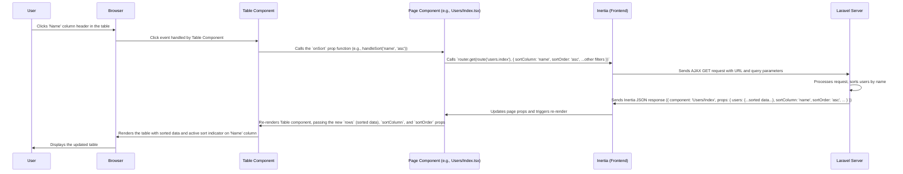

# Chapter 6: Data Table Component

Welcome back! In our journey through the `code_to_analyze` project's frontend, we've learned how the [Authenticated Layout](01_authenticated_layout_.md) provides a consistent frame, how [Inertia.js Page Structure](02_inertia_js_page_structure_.md) delivers page components and data from the backend, how [React Components](03_react_components_.md) are our reusable UI building blocks, and how [Application Data Types (TypeScript)](04_application_data_types__typescript__.md) give us blueprints for our data. Most recently, in [Chapter 5: Data Fetching and Forms (Inertia)](05_data_fetching_and_forms__inertia_.md), we saw how to get that data using `usePage` and send it back using `useForm` or the `router` object.

Now that we know how to *get* lists of data from the server (like lists of agencies or users), the next challenge is displaying that data neatly and making it easy for users to interact with.

### The Problem: Displaying Lists

Imagine you have a list of agencies received from the server, like the `agencies` prop we saw in `resources/js/Pages/Dashboard.tsx`. You need to show this data in a structured table format, with columns for "Name", "Actions", etc.

You could write the HTML `<table>`, `<thead>`, `<tbody>`, `<tr>`, and `<td>` tags directly in your page component, looping through the list of agencies to create the rows and cells. However, if you then needed to display a list of users (`resources/js/Pages/Users/Index.tsx`) or a list of tasks (`resources/js/Pages/Farmers/Index.tsx`), you'd have to write very similar table code all over again.

What if you wanted to add features like sorting columns (clicking the header to sort by name) or searching through the data? You'd have to implement that logic in every page that displays a table. This would lead to a lot of repeated code and make it hard to ensure a consistent look and feel for all tables in the application.

### The Solution: The `Table` Component

This is exactly the problem the **`Table` component** (found in `resources/js/Components/Table/Table.tsx`) is designed to solve.

Think of it as a **highly customizable spreadsheet display widget**. Instead of writing the table structure yourself, you tell the `Table` component:

1.  **What columns** to show (what to display and how to label the header).
2.  **Which data rows** to display.

The `Table` component then takes care of rendering the `<table>` structure and looping through your data to create the rows and cells. It also includes built-in features like **sorting** and **searching** that you can easily enable and configure by passing simple instructions (props) to the component.

It's like having a smart assistant who can display any list you give them, arranging it neatly in columns you specify, and even helping the user sort and search if you ask them to.

### How to Use the `Table` Component

Let's look at how pages like `resources/js/Pages/Dashboard.tsx` (Agencies) and `resources/js/Pages/Users/Index.tsx` use the `Table` component.

First, you import it:

```typescript
// In your page or component file (e.g., resources/js/Pages/Dashboard.tsx)
import Table from "@/Components/Table/Table";
// ... other imports ...
```

Then, inside your component's JSX, you use the `<Table>` tag and pass it two essential pieces of information via props: `columns` and `rows`.

#### 1. Defining Columns (`columns` prop)

The `columns` prop is an **array** where each item in the array is an **object** describing one column in the table.

Look at the simplified example from `resources/js/Pages/Dashboard.tsx` for the Agencies table:

```typescript
// Snippet from resources/js/Pages/Dashboard.tsx
import Table from "@/Components/Table/Table";
// ... other imports ...

export default function Dashboard({ auth }: PageProps) {
  const { agencies } = usePage<{ agencies: PaginatedData<Agency>; }>().props;
  const { data } = agencies; // 'data' is the array of agency objects

  return (
    <AuthenticatedLayout user={auth.user} header={<h2 /* ... */>Agencies</h2>}>
      {/* ... page content ... */}
      <Table
        // columns prop: An array of column definitions
        columns={[
          {
            label: '#',     // Text for the table header
            name: 'id',     // The property name on your data object (e.g., agency.id)
          },
          {
            label: 'Name',
            name: 'name',   // Looks for agency.name
          },
          // ... other column definitions ...
        ]}
        // rows prop: The array of data objects to display
        rows={data} // Pass the array of agency objects here
      />
      {/* ... pagination or other content ... */}
    </AuthenticatedLayout>
  );
}
```

**Explanation:**

*   The `columns` prop is an array `[...]`.
*   Each object inside the array defines a column:
    *   `label`: The text that will appear in the table's header row (e.g., "Name").
    *   `name`: This is important! It's the **name of the property** on your data objects (`rows`) that contains the value for this column (e.g., for a row like `{ id: 1, name: 'Agency A' }`, the column with `name: 'name'` will try to display the value of `row.name`, which is `'Agency A'`).

With just these two columns defined, the `Table` component will render headers "Name" and "Actions" and, for each agency object in your `data` array, it will try to display `agency.id` and `agency.name` in the corresponding cells.

#### 2. Customizing Cell Content (`renderCell` prop)

What if you need more than just displaying a simple property value? For example, the "Actions" column in the Agencies table contains links and buttons (Edit, Delete) instead of just a single text value.

The `columns` definition allows you to include an optional function called `renderCell`. If this function is provided, the `Table` component will call it for each row in that column and use whatever React elements (JSX) the function returns as the content for the cell.

Look at the "Action" column definition from `resources/js/Pages/Dashboard.tsx`:

```typescript
// Snippet from resources/js/Pages/Dashboard.tsx
import Table from "@/Components/Table/Table";
import { Link, router } from "@inertiajs/react"; // Needed for Link and router
import { FontAwesomeIcon } from '@fortawesome/react-fontawesome'; // Needed for icons
import { faEdit, faTrash, faEye } from '@fortawesome/free-solid-svg-icons';
// ... other imports ...

export default function Dashboard({ auth }: PageProps) {
  // ... get agencies data ...
  const { data } = agencies;

  // This function is used by the Delete button inside the table
  function destroy(id : number | string) : void {
    if (confirm('Are you sure you want to delete this agency?')) {
      router.delete(route('dashboard.agencies.destroy', id));
    }
  }

  return (
    <AuthenticatedLayout user={auth.user} header={<h2 /* ... */>Agencies</h2>}>
      {/* ... page content ... */}
      <Table
        columns={[
          // ... other columns ...
          {
            label: 'Action', // Header label
            name: 'action', // Name is still required, but not strictly used if renderCell exists
            // renderCell function: Receives the current row object as an argument
            renderCell: row => (
              <> {/* Use a React Fragment to return multiple elements */}
                {/* 'row' here is one Agency object */}
                <Link
                  className="/* ...styles... */"
                  href={route('dashboard.agencies.show',row.id)} // Use row.id to generate the URL
                >
                  <FontAwesomeIcon icon={faEye}/>
                </Link>
                <Link
                  className="/* ...styles... */"
                  href={route('dashboard.agencies.edit',row.id)} // Use row.id
                >
                  <FontAwesomeIcon icon={faEdit}/>
                </Link>
                <button
                  className="/* ...styles... */"
                  onClick={() => destroy(row.id)} // Use row.id to call the destroy function
                >
                  <FontAwesomeIcon icon={faTrash}/>
                </button>
              </>
            )
          },
        ]}
        rows={data}
      />
      {/* ... pagination or other content ... */}
    </AuthenticatedLayout>
  );
}
```

**Explanation:**

*   The `renderCell` property is a function: `row => (...)`.
*   This function receives the current `row` data object (e.g., one `Agency` object) as its argument.
*   Inside the function, you can use the data from the `row` object (like `row.id`) to create any JSX you need for that cell.
*   In this case, it returns multiple elements (`<Link>`, `<button>`) wrapped in a React Fragment (`<>...</>`), which is common when a component needs to return more than one top-level element.
*   This allows you to put complex UI elements like links, buttons, status badges, or formatted dates directly into table cells.

#### 3. Enabling Sorting and Searching

The `Table` component also provides props to enable built-in sorting and searching features. These features don't handle the *actual* sorting or searching themselves (that happens on the server for performance), but they provide the UI (sort icons in headers, search input) and tell your page component *when* the user wants to sort or search.

Let's look at the Users page (`resources/js/Pages/Users/Index.tsx`) which uses these features:

```typescript
// Snippet from resources/js/Pages/Users/Index.tsx
import Table from "@/Components/Table/Table";
import { usePage, router } from "@inertiajs/react"; // Need usePage and router
import { PaginatedData, Officer } from '@/types'; // Need data types from Chapter 4
// ... other imports ...

export default function Dashboard({ auth }: PageProps) {
  // Get initial data and current filter/sort state from the server (Chapter 5)
  const { users, sortColumn ,sortOrder,search } = usePage<{
    users: PaginatedData<Officer>;
    sortColumn : string;
    sortOrder : 'asc' | 'desc';
    search : string;
  }>().props;

  const { data, links } = users; // Extract the user data array

  // Function to handle sorting changes
  function handleSort(column : string, order : 'asc' | 'desc'){
    // This function is called by the Table component when a sortable header is clicked.
    // We use Inertia's router.get to fetch the page again with new sort parameters.
    applyFilters({search : search, sortColumn : column , sortOrder : order});
  }

  // Function to handle search input changes (triggered on Enter or button click in Table)
  function handleSearch(q : string){
     // Called by the Table component when search is triggered.
    applyFilters({search : q, sortColumn : sortColumn , sortOrder : sortOrder});
  }

  // Helper function to make the Inertia request with current filters/sort
  function applyFilters(params : {search : string;sortColumn : string;sortOrder : string}){
    router.get(route('users.index'),params); // router.get from Chapter 5
  }

  function reset(){
      router.get(route('users.index')); // Reset button calls this
  }

  function handleRowClick(row:Officer){
    router.get(route('users.show',row.id)); // Example of onRowClick
  }


  return (
    <AuthenticatedLayout user={auth.user} header={<h2 /* ... */>User management</h2>}>
      {/* ... page content ... */}
      <Table
        // Props to enable and control searching
        isSearchable={true} // Show the search input and button
        search={search} // Pass the current search term (from server props)
        onSearch={handleSearch} // Function to call when search is triggered
        onReset={reset} // Function to call when reset is triggered

        // Props to control sorting state (passed from server via usePage)
        sortColumn={sortColumn} // Name of the column currently sorted by
        sortOrder={sortOrder} // Current sort order ('asc' or 'desc')
        onSort={handleSort} // Function to call when a sortable header is clicked

        onRowClick={handleRowClick} // Function called when a non-action cell is clicked

        columns={[
          {
            label: 'ID',
            name: 'id',
            sorting : true, // Enable sorting for THIS column
            renderCell: row => (<>{row.id}</>)
          },
          {
            label: 'Name',
            name: 'name',
            sorting : true // Enable sorting for THIS column
            // ... renderCell or default display ...
          },
          // ... other columns ...
        ]}
        rows={data} // Pass the array of user objects
      />
      {/* ... pagination links using 'links' from usePage().props ... */}
      {/* Pagination links are rendered *outside* the Table component */}
      <div className="flex items-center justify-center mt-4 mb-4">
        {links.map((link, index) => (
          <button
            key={index}
            disabled={!link.url}
            // When a pagination link is clicked, use Inertia router.get
            onClick={() => router.get(link.url+'&sortOrder='+sortOrder+'&sortColumn='+sortColumn+'&seach='+search)}
            className="/* ...styles... */"
            dangerouslySetInnerHTML={{ __html: link.label }} // Use innerHTML for << and >> arrows
          />
        ))}
      </div>
      {/* ... rest of page ... */}
    </AuthenticatedLayout>
  );
}
```

**Explanation:**

*   **Search:**
    *   `isSearchable={true}`: Tells the `Table` component to render the search input field and buttons.
    *   `search={search}`: Passes the *current* search term (received from the server via `usePage().props`) to the `Table` component so it can display the current search value in the input field.
    *   `onSearch={handleSearch}`: Passes the `handleSearch` function defined in the page component. When the user types in the search box and presses Enter or clicks the search icon, the `Table` component calls this function, giving it the current value from the search input.
    *   `onReset={reset}`: Passes the `reset` function. The Table component provides a "Cancel Search" button (or similar) which calls this function.
    *   Inside `handleSearch` (and `reset`), the page component uses `router.get` to request the *same* page again, but includes the search term (and current sort settings) as query parameters. The server then processes this request, fetches the *filtered* data, and returns it via Inertia, causing the page (and thus the `Table`) to re-render with the search results.
*   **Sorting:**
    *   `sorting: true` in a column definition: Tells the `Table` component to render sort icons next to this column's header.
    *   `sortColumn={sortColumn}`: Passes the name of the column that is currently being sorted (received from the server). The `Table` component uses this to highlight the active sort icons.
    *   `sortOrder={sortOrder}`: Passes the current sort direction ('asc' or 'desc', also from the server).
    *   `onSort={handleSort}`: Passes the `handleSort` function defined in the page component. When the user clicks a sortable column header, the `Table` component calls this function, providing the column's `name` and the requested sort direction ('asc' or 'desc').
    *   Inside `handleSort`, similar to searching, the page component uses `router.get` to request the page again, but this time including the new sort column and order parameters. The server fetches and sorts the data accordingly, and Inertia updates the page.
*   **Row Click:**
    *   `onRowClick={handleRowClick}`: Passes the `handleRowClick` function. When a user clicks on a table cell (except for the last column, which often contains action buttons), this function is called, and the `Table` component passes the `row` data object that was clicked. This is used in the Users and Agencies tables to navigate to the "show" page for that item (`router.get(route('users.show', row.id))`).

This pattern (Table component providing UI and triggering events, page component handling the actual data fetching/navigation using `router`) is a powerful way to build interactive data tables.

### Under the Hood: How the `Table` Component Works (Simplified)

Let's peek inside the `Table` component itself (`resources/js/Components/Table/Table.tsx`) to understand how it uses the props you provide to render the HTML table.

**Walkthrough:**

1.  The `Table` component is a React function component that accepts the `TableProps<T>` (where `T` is the type of your data objects, like `Agency` or `Officer`).
2.  It receives the `columns`, `rows`, `isSearchable`, `onSearch`, `sortColumn`, `sortOrder`, `onSort`, etc., as props.
3.  It first conditionally renders the search bar area if `isSearchable` is true. This area contains a `TextInput` (another component from [Chapter 3: React Components](03_react_components_.md)) whose value is managed by internal state (`searchValue`), and buttons for Search and Reset which trigger the `onSearch` and `onReset` props when clicked.
4.  It then renders the `<table>` element.
5.  It renders the `<thead>` (table header). It loops through the `columns` array. For each `column` object, it renders a `<th>` element with the `column.label`. If `column.sorting` is true and `onSort` prop was provided, it also renders up/down arrow buttons inside the header cell. When these buttons are clicked, they call the `onSort` prop function, passing the `column.name` and the direction ('asc' or 'desc').
6.  It renders the `<tbody>` (table body). It loops through the `rows` array. For each `row` data object:
    *   It renders a `<tr>` (table row). This row might have an `onClick` handler if the `onRowClick` prop was provided.
    *   Inside the row, it loops through the `columns` array again. For each `column` object:
        *   It renders a `<td>` element.
        *   It checks if the `column.renderCell` function exists.
            *   If `renderCell` exists, it calls `column.renderCell(row)` and renders whatever JSX that function returns inside the `<td>`.
            *   If `renderCell` does *not* exist, it tries to find the value on the `row` object using the `column.name` property (e.g., `row[column.name]`). It uses a utility function (`get` from `lodash`) which can handle nested properties (like `user.agency.name`). It then displays this value in the `<td>`. If the value is not found, it displays "N/A".
7.  Pagination links are typically rendered *outside* the `Table` component, usually after it on the page, using the `links` data from `usePage().props`.

**Sequence Diagram (Sorting Example):**



**Simplified Code Snippets from `Table.tsx`:**

The `TableProps` interface defines the expected shape of the props, making it clear what data the component needs:

```typescript
// Snippet from resources/js/Components/Table/Table.tsx
interface TableProps<T> {
    // Definition of columns - array of objects
    columns: {
        name: string; // Property name on row data
        label: string; // Header text
        colSpan?: number; // Optional: how many columns this header spans
        sorting?: boolean; // Optional: enable sorting for this column
        renderCell?: (row: T) => React.ReactNode; // Optional: custom render function
    }[];
    rows: T[]; // Array of data objects (of type T)
    sortColumn?: string; // Optional: name of current sort column
    sortOrder?: "asc" | "desc"; // Optional: current sort order
    onSort?: (columnName: string, sortOrder: "asc" | "desc") => void; // Optional: function called on sort click
    onSearch?: (search: string) => void; // Optional: function called on search
    onRowClick?: (row: T) => void; // Optional: function called on row click
    isSearchable?: boolean; // Optional: show search bar
    search?: string; // Optional: current search term
    // ... other props like onReset, onBulkAccept ...
}
```

The rendering logic involves looping through rows and columns:

```typescript
// Simplified snippet from resources/js/Components/Table/Table.tsx
import get from "lodash/get"; // Helper to get potentially nested property values

export default function Table<T>({
    columns = [],
    rows = [],
    onSort, // Destructure props needed for rendering/events
    // ... other props ...
}: TableProps<T>) {

    return (
        <div className="/* ...styles... */">
            {/* ... Search bar rendering (if isSearchable) ... */}
            <table className="/* ...styles... */">
                <thead>
                    <tr>
                        {columns?.map((column) => (
                            <th key={column.label} onClick={() => { /* handle header click if needed */ }}>
                                <span>{column.label}</span>
                                {/* Render sorting buttons if column.sorting is true and onSort exists */}
                                {column.sorting && onSort && (
                                    <span>
                                        {/* ... Up/Down arrow buttons ... */}
                                        {/* onClick on buttons call onSort(column.name, 'asc'/'desc') */}
                                    </span>
                                )}
                            </th>
                        ))}
                    </tr>
                </thead>
                <tbody>
                    {/* Handle empty state */}
                    {rows?.length === 0 && (
                        <tr><td colSpan={columns.length}>No data found.</td></tr>
                    )}
                    {/* Loop through rows */}
                    {rows?.map((row, rowIndex) => (
                        // Render table row, add onClick if onRowClick exists
                        <tr key={rowIndex} onClick={() => onRowClick?.(row)} className={onRowClick ? "cursor-pointer" : ""}>
                            {/* Loop through columns for the current row */}
                            {columns.map((column, colIndex) => (
                                <td key={column.name} className="/* ...styles... */">
                                    {/* Check if renderCell exists, otherwise use column.name */}
                                    {column.renderCell?.(row) ?? get(row, column.name) ?? "N/A"}
                                </td>
                            ))}
                        </tr>
                    ))}
                </tbody>
            </table>
        </div>
    );
}
```

This simplified view shows how the component uses the `columns` array to build both the header (`<thead>`) and the data cells (`<td>`) in the body (`<tbody>`), deciding what to put in each cell based on whether a `renderCell` function is provided or if it should just read a property from the `row` data object using `column.name`. It also adds the UI elements (like sort icons) and event handlers (like `onClick` for sorting) based on the props passed to it.

### Conclusion

In this chapter, we learned about the reusable **`Table` component**. We saw how it solves the problem of displaying lists of data in a structured, consistent way across the application by accepting column definitions and data rows as props. We explored how to define columns, customize cell content using `renderCell`, and easily enable interactive features like **sorting** and **searching** by providing relevant props (`isSearchable`, `onSearch`, `sortColumn`, `sortOrder`, `onSort`). We also briefly looked at how the component works internally and how it integrates with the Inertia `router` via event handler props defined in the page components to fetch updated data.

Using the `Table` component allows developers to quickly display lists of data with powerful features without writing repetitive table code on every page.

Next, we'll look at components used specifically for displaying visual data, in [Chapter 7: Task Gallery Components](07_task_gallery_components_.md).

---

Generated by [AI Codebase Knowledge Builder](https://github.com/The-Pocket/Tutorial-Codebase-Knowledge)