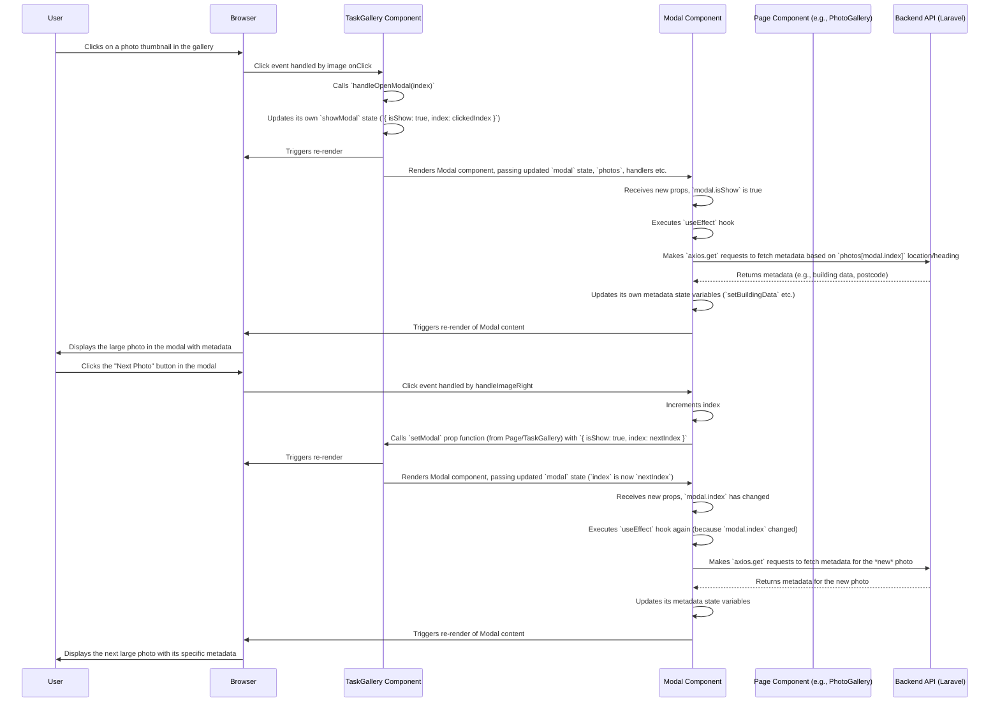

# Chapter 7: Task Gallery Components

Welcome back! In our previous chapter, [Chapter 6: Data Table Component](06_data_table_component_.md), we learned how to display lists of structured data like users or agencies in a sortable, searchable table format using the reusable `Table` component. That's great for text and numbers, but what about visual information, like photos?

If a task involves taking pictures (like inspecting a location), simply listing the photo file paths in a table cell isn't very helpful. Users need to *see* the photos, browse through them, maybe view details about *where* and *when* a photo was taken, rotate it, or even select multiple photos for an action like generating a report.

### The Problem: Showing Collections of Photos

Imagine a page dedicated to showing all photos related to a specific task or even a collection of unassigned photos. You need a user interface that:

1.  Displays the photos clearly.
2.  Allows easy browsing (perhaps a grid or a slider).
3.  Lets a user click a photo to see a larger version.
4.  Shows relevant information (like location, time, camera details) for the selected photo.
5.  Provides tools like rotation or selection.

Building all of this from scratch every time you need to show photos would be a lot of work!

### The Solution: Task Gallery Components

This is where the **Task Gallery Components** come in. They are a set of React components specifically designed for displaying collections of photos within the application.

Think of them as a **digital photo album viewer**, tailored for the photos collected during tasks. They provide the visual layout and the interactive features needed to browse and manage photo collections.

The primary components for this are:

1.  **`TaskGallery.tsx`**: This component displays the *collection* of photos, usually in a grid or a slider format. It's the main viewer you see on pages like the Task detail page (`resources/js/Pages/Farmers/Task.tsx`) or the Unassigned Photo Gallery page (`resources/js/Pages/Farmers/PhotoGallery.tsx`).
2.  **`Modal_.tsx`**: This component works alongside `TaskGallery.tsx`. It's a pop-up (modal) window that appears when you click a photo in the gallery. It shows the selected photo in a larger view and displays detailed metadata about it.

These components work together to give users a rich experience for interacting with task photos.

### Using the `TaskGallery.tsx` Component

The `TaskGallery` component is responsible for showing the array of photos you pass to it. It handles the layout (grid/slider) and manages the state for opening the detailed modal view.

You can see it used prominently in `resources/js/Pages/Farmers/PhotoGallery.tsx` and `resources/js/Pages/Farmers/Task.tsx`.

Let's look at a simplified example from `resources/js/Pages/Farmers/PhotoGallery.tsx`:

```typescript
// Snippet from resources/js/Pages/Farmers/PhotoGallery.tsx
import { PageProps, Photo, SplitViewState } from "@/types"; // Need Photo type from Chapter 4
import { useState, useEffect } from "react";
import AuthenticatedLayout from "@/Layouts/AuthenticatedLayout"; // Layout from Chapter 1
import { Head } from "@inertiajs/react";
import TaskGallery from "@/Components/TaskGallery/TaskGallery"; // Import the gallery component
// ... other imports ...

export function PhotoGallery({ auth, photos: initialPhotos, splitMode }: PageProps) { // photos prop comes from Inertia (Chapter 5)

    // We need to manage the state of photos in this component
    // because we allow actions like selection or rotation which update the photos array.
    const [photo_, setPhotos] = useState<Array<Photo>>([]);

    // Load the initial photos data into our component's state when it first mounts
    useEffect(() => {
        setPhotos(initialPhotos);
    }, [initialPhotos]); // Re-run if initialPhotos from Inertia changes

    // Function to handle deleting photos (passed down to gallery)
    function destroy(ids: string): void {
        if (confirm("Are you sure you want to delete this photo?")) {
            router.delete(route("photo_gallery.destroy", ids), {
                onSuccess: (res) => {
                    // After successful delete, update the photo list state
                    setPhotos(photo_.filter((photo) => !ids.includes(photo.id.toString())));
                },
            });
        }
    }

    // ... other state and handler functions (e.g., for selection) ...

    return (
        <AuthenticatedLayout user={auth.user} header={<h2 /* ... */>Photo Gallery</h2>}>
            <Head title="Photo gallery" />
            {/* ... other page content like map or buttons ... */}

            {/* Use the TaskGallery component here */}
            <TaskGallery
                photos={photo_} // Pass the current array of photos (managed in state)
                isUnassigned={true} // A prop specific to this page (unassigned photos)
                destroy={destroy} // Pass the delete handler down
                setPhotos={setPhotos} // Pass the state setter down so gallery can update check/angle
                isSplitView={splitMode} // Pass the split view mode
            />

            {/* ... other page content ... */}
        </AuthenticatedLayout>
    );
}
```

**Explanation:**

1.  `import TaskGallery from "@/Components/TaskGallery/TaskGallery";`: We import the component.
2.  `const [photo_, setPhotos] = useState<Array<Photo>>([]);`: The page component manages the list of photos using React's `useState` hook. We initialize this state with the `photos` prop received from Inertia ([Chapter 5: Data Fetching and Forms (Inertia)](05_data_fetching_and_forms__inertia_.md)). We use the `Photo` [TypeScript type](04_application_data_types__typescript__.md) to ensure type safety.
3.  `<TaskGallery ... />`: We use the component, passing it the list of photos from our state (`photo_`) via the `photos` prop.
4.  We also pass down various handler functions (`destroy`, `setPhotos`) and configuration props (`isUnassigned`, `isSplitView`). Passing `setPhotos` allows the `TaskGallery` component (and the `Modal_` it renders) to update the state in this parent component when, for example, a photo is selected (changes its `check` property) or rotated (changes its `angle` property).

The `TaskGallery` component itself doesn't fetch the initial data (that's done by the server and passed via Inertia, accessed by the page component using `usePage` as seen in [Chapter 5](05_data_fetching_and_forms__inertia_.md)), nor does it directly talk to the server for actions like deleting or rotating. Instead, it receives the data and event handlers as props, making it reusable.

### Inside the `TaskGallery.tsx` (Simplified)

Let's peek inside `TaskGallery.tsx` to see how it uses these props.

```typescript
// Simplified Snippet from resources/js/Components/TaskGallery/TaskGallery.tsx
import { useState } from "react";
import { GalleryProps } from "@/types"; // Import prop types from Chapter 4
import Modal_ from "./Modal_"; // Import the Modal component
import Slider from "react-slick"; // A third-party library for the slider

const TaskGallery = ({
    photos, // Array of Photo objects (from props)
    isUnassigned, // Boolean flag (from props)
    destroy, // Delete function (from props)
    setPhotos, // State setter for photos (from props)
    isSplitView, // Boolean flag (from props)
}: GalleryProps) => {

    // State to control the visibility and index of the modal
    const [showModal, setShowModal] = useState({ isShow: false, index: -1 });

    // Settings for the react-slick slider (simplified)
    const settings = {
        dots: true,
        infinite: false,
        speed: 500,
        slidesToShow: Math.min(photos.length, isSplitView ? 2 : 4), // Show different number based on split view
        slidesToScroll: 1,
        // ... arrow components ...
    };

    // Handler for rotating a photo (updates state and calls backend)
    const handleRotate = async (digest: string, direction: string) => {
        let pId = 0;
        const withAngleUpdate = photos.map((photo) => {
            if (photo.digest === digest) { // Find the photo by its unique digest
                pId = photo.id;
                // Calculate the new angle (+90 or -90)
                const newAngle = photo?.angle ? (direction === "left" ? photo?.angle - 90 : photo?.angle + 90) : (direction === "left" ? -90 : 90);
                return { ...photo, angle: newAngle }; // Return updated photo object
            }
            return photo; // Return other photos unchanged
        });
        setPhotos(withAngleUpdate); // Update the state in the parent component (via prop)
        // Call the backend to save the new angle (using axios, not Inertia router here)
        await axios.post(route('rotate-photo'), { id: pId, angle: newAngle });
        alert('Photo rotated successfully.'); // Simple feedback
    };

    // Handler to open the modal
    const handleOpenModal = (index: number) => {
        setShowModal({ isShow: true, index: index });
    };

    // Handler to close the modal
    const handleCloseModal = () => {
         // IMPORTANT: Reset modal state first, then call the handler
         setShowModal({ isShow: false, index: -1 });
         // The actual data clearing for metadata is done INSIDE Modal_ on close
    };

    // Handler for selecting a photo (updates the 'check' property)
    const handlePhotoCheckBox = (digest: string) => {
        const withCheckUpdate = photos.map((photo) => {
            if (photo?.digest === digest) {
                const check = !photo.hasOwnProperty("check") ? true : !photo?.check;
                return { ...photo, check: check }; // Toggle or set 'check'
            }
            return photo;
        });
        setPhotos(withCheckUpdate); // Update the state in the parent component (via prop)
    };

    return (
        <> {/* Use a Fragment to return multiple elements */}
            <div className="/* ...styles for layout/padding... */">
                <div className="/* ...styles for slider container... */">
                     {/* Render the Slider component */}
                    <Slider {...settings} className="/* ...styles... */">
                        {/* Loop through the photos array passed as a prop */}
                        {photos?.map((photo, index) => {
                            const imageSrc = photo?.link || '/images/dummy-image.jpg';
                            return (
                                <div className="/* ...styles for each slide item... */" key={photo.id || index}> {/* Use unique ID for key */}
                                    <div className={`/* ...styles for photo container, including ring if checked... */ ${photo.check ? 'ring-2 ring-blue-500' : ''}`}>
                                        {/* The image itself */}
                                         handleOpenModal(index)} // Open modal on image click
                                        />

                                        {/* Overlay with action buttons (shown on hover) */}
                                        <div className="/* ...styles for overlay and hover effect... */" onClick={() => handleOpenModal(index)}>
                                             <div className="/* ...styles for buttons container... */" onClick={(e) => e.stopPropagation()}> {/* Stop click from propagating to overlay/image */}
                                                {isUnassigned && ( // Show delete button only if unassigned gallery
                                                    <FaTrash onClick={(e) => { e.stopPropagation(); destroy!([photo.id].join(",")); }} title="Delete photo" />
                                                )}
                                                <FaSync style={{ transform: "scaleX(-1)" }} onClick={(e) => { e.stopPropagation(); handleRotate(photo.digest, "left"); }} title="Rotate left" />
                                                <FaSync onClick={(e) => { e.stopPropagation(); handleRotate(photo.digest, "right"); }} title="Rotate right" />
                                                <FaCheck onClick={(e) => { e.stopPropagation(); handlePhotoCheckBox(photo?.digest); }} title="Select photo" className={photo.check ? 'text-blue-500' : 'text-gray-600'} />
                                                <FaEye onClick={(e) => { e.stopPropagation(); router.get(route("photo_detail", photo.id)); }} title="View photo details" />
                                            </div>
                                        </div>
                                    </div>
                                    {/* Render check indicator if selected */}
                                    {photo.check && (<div className="/* ...selection indicator styles... */"></div>)}
                                </div>
                            );
                        })}
                    </Slider>
                </div>
            </div>

            {/* Render the Modal component, passing its state and handlers */}
            <Modal_
                modal={showModal} // Pass the modal state
                setModal={setShowModal} // Pass the modal state setter (used by modal for navigation)
                handleClose={handleCloseModal} // Pass the function to close the modal
                photos={photos} // Pass the array of photos (so modal can access data and navigate)
                rotateLeft={(digest: string) => handleRotate(digest, "left")} // Pass rotate handlers
                rotateRight={(digest: string) => handleRotate(digest, "right")}
            />
        </>
    );
};

export default TaskGallery;
```

**Explanation:**

1.  It uses `useState` to keep track of whether the modal should be shown (`showModal.isShow`) and which photo's details to display (`showModal.index`).
2.  It renders a `<Slider>` component (from `react-slick` library) and passes it configuration `settings`.
3.  It maps over the `photos` array received via props. For each `photo` object, it renders a `div` containing:
    *   An `` tag displaying the photo using its `link` property (`photo?.link`). It applies the rotation angle (`photo?.angle`) from the data via CSS `transform`. Clicking the image calls `handleOpenModal`.
    *   An overlay div that appears on hover, containing icons (`FaTrash`, `FaSync`, etc. from `react-icons` library). Clicking these icons triggers the respective handler functions (`destroy`, `handleRotate`, `handlePhotoCheckBox`, `router.get` for detail page). Notice how click events on the icons call `e.stopPropagation()` to prevent the click from also triggering the image/overlay click handler that opens the modal.
4.  It defines handler functions like `handleRotate`, `handleOpenModal`, `handleCloseModal`, and `handlePhotoCheckBox`.
    *   `handleOpenModal` and `handleCloseModal` simply update the `showModal` state.
    *   `handlePhotoCheckBox` and `handleRotate` update the `photo_` state in the *parent* component by calling the `setPhotos` prop function. This makes the selection ring appear or the image visibly rotate.
    *   `handleRotate` also makes an `axios.post` request to a backend route (`rotate-photo`) to *save* the rotation angle permanently in the database. (Note: It uses `axios` directly here, not `router.post`. Both methods are possible for sending data back, as discussed in [Chapter 5](05_data_fetching_and_forms__inertia_.md), though `router.post` is more common for actions that might involve Inertia page transitions or flash messages).
5.  Finally, it renders the `<Modal_>` component, passing the `showModal` state, the `photos` array, the `handleCloseModal` function, and the `handleRotate` function (split into `rotateLeft` and `rotateRight` props for clarity in the Modal's props).

### Using and Inside the `Modal_.tsx` Component

The `Modal_` component is designed to be rendered conditionally by the `TaskGallery` component. It receives the state telling it *if* to show and *which* photo to show, the array of photos (to allow navigation between them), and handler functions for closing and rotating.

Let's look at a simplified structure of `Modal_.tsx`:

```typescript
// Simplified Snippet from resources/js/Components/TaskGallery/Modal_.tsx
import { useEffect, useState } from "react";
import { GalleryModalProps } from "@/types"; // Import prop types from Chapter 4
import { FaSync, FaTimes, FaEye } from "react-icons/fa";
import { router } from "@inertiajs/react"; // For navigating to detail page
import axios from "axios"; // For fetching metadata

const Modal_ = ({
    modal, // { isShow: boolean, index: number } state from parent
    setModal, // State setter for modal state (used for navigation)
    handleClose, // Function to close the modal (from parent)
    photos, // Array of photos (from parent)
    rotateLeft, // Rotate left function (from parent)
    rotateRight, // Rotate right function (from parent)
}: GalleryModalProps) => {

    // Get the currently selected photo based on the index from the modal state
    const photo = photos[modal.index];

    // State variables to hold fetched metadata
    const [buildingData, setBuildingData] = useState<any>(null);
    // ... other metadata state variables (shapeData, codepointData, uprnData, etc.) ...

    // useEffect hook to fetch metadata when the modal opens or the photo changes
    useEffect(() => {
        // Only fetch if the modal is showing and a photo is selected
        if (modal.isShow && photo) {
            // --- Data Fetching Logic ---
            // Get photo location and direction (Chapter 4 types help here!)
            const lat = photo.lat;
            const lng = photo.lng;
            const heading = photo.photo_heading || 0;

            // Example fetch for Building Data (uses axios to call a backend API endpoint)
            const fetchBuildingData = async () => {
                if (lat && lng) { // Check if lat/lng exist
                    try {
                        const response = await axios.get("/comm_building_part_nearest", {
                            params: { latitude: lat, longitude: lng, imagedirection: heading }
                        });
                        // Process response and update buildingData state
                        if (response.data?.success && response.data.data.building_part.length > 0) {
                            setBuildingData(response.data.data.building_part[0].geojson.features[0].properties);
                        } else {
                            setBuildingData(null);
                        }
                    } catch (error) {
                        console.error("Error fetching building data:", error);
                        setBuildingData(null);
                    }
                }
            };

            // Call all the different data fetching functions
            fetchBuildingData();
            // ... call other fetch functions (fetchShapeData, fetchCodepointData, etc.) ...
        } else {
             // Reset data when the modal is closed
             setBuildingData(null);
             // ... reset other metadata state variables ...
        }
    }, [modal.isShow, modal.index, photos]); // Dependencies: re-run if modal state or photos array changes

    // Handler to navigate to the previous image in the collection
    const handleImageLeft = () => {
        let indexCheck = modal.index;
        if (--indexCheck >= 0) { // Check if index is valid
            setModal((prevData: any) => ({ // Use setModal from parent to update modal state
                ...prevData,
                index: indexCheck, // Update the index to the previous one
            }));
            // Note: useEffect above will automatically fetch data for the new photo
        }
    };

    // Handler to navigate to the next image
    const handleImageRight = () => {
        let indexCheck = modal.index;
        if (++indexCheck < photos.length) { // Check if index is valid
             setModal((prevData: any) => ({ // Use setModal from parent
                ...prevData,
                index: indexCheck, // Update the index to the next one
            }));
            // Note: useEffect will fetch data for the new photo
        }
    };

    // Wrapped close handler to ensure local state reset before closing
    const onCloseModal = () => {
        // Reset local metadata state before closing
        setBuildingData(null);
        // ... reset other metadata state variables ...
        handleClose(); // Call the parent's close handler
    };

    // Don't render anything if modal is not showing
    if (!modal?.isShow || !photo) return null;

    // --- JSX Rendering ---
    return (
        <div className="fixed inset-0 z-50 /* ...styles for modal backdrop... */">
            <div className="/* ...styles for modal content container... */">
                {/* Header with close button */}
                <div className="flex justify-end pt-3 pr-3 flex-shrink-0">
                    <button onClick={onCloseModal} className="/* ...close button styles... */">
                        <FaTimes />
                    </button>
                </div>

                {/* Action buttons (Rotate, View Details) */}
                <div className="flex px-5 gap-4 -mt-1 flex-shrink-0 mb-4">
                     {/* Rotate buttons call the parent's rotate handlers */}
                    <FaSync style={{ transform: "scaleX(-1)" }} onClick={() => rotateLeft(photo.digest, "left")} title="Rotate left" />
                    <FaSync onClick={() => rotateRight(photo.digest, "right")} title="Rotate right" />
                    {/* View Details button navigates using Inertia router */}
                    <div className="cursor-pointer" onClick={() => { router.get(route("photo_detail", photo.id)); }}>
                        <FaEye title="View photo details" />
                    </div>
                </div>

                {/* Scrollable content area */}
                <div className="overflow-y-auto flex-grow scrollbar-hide">
                    {/* Large Image */}
                    <div className="px-6 py-4">
                         
                    </div>

                    {/* Metadata section */}
                    <div className="px-6 py-4 text-sm bg-gray-50 dark:bg-gray-900">
                        <div className="grid grid-cols-2 gap-y-2">
                             {/* Display photo metadata using 'photo' object properties */}
                            <div className="text-gray-500">Latitude</div>
                            <div className="text-right font-medium">{photo?.lat ? Number(photo.lat).toFixed(3) : ''}</div>

                             {/* Display fetched external metadata */}
                            <div className="text-gray-500">TOID</div>
                            <div className="text-right font-medium">{buildingData?.TOID}</div>

                            {/* ... display other photo and fetched metadata ... */}
                             <div className="text-gray-500">Note</div>
                            <div className="text-right font-medium">{photo?.note}</div>
                        </div>
                    </div>
                </div>

                {/* Navigation buttons (rendered on edges, omitted in simplified code for brevity) */}
                {/* <button className="absolute left-0 top-1/2 ...styles..." onClick={handleImageLeft}>...</button> */}
                {/* <button className="absolute right-0 top-1/2 ...styles..." onClick={handleImageRight}>...</button> */}

            </div>
        </div>
    );
};

export default Modal_;
```

**Explanation:**

1.  The component receives the `modal` state, `setModal`, `handleClose`, `photos`, `rotateLeft`, and `rotateRight` as props (defined by the `GalleryModalProps` interface from [Chapter 4](04_application_data_types__typescript__.md)).
2.  It uses a `useEffect` hook to fetch additional metadata (Building data, Postcode, UPRN, etc.) from various backend API endpoints (`/comm_building_part_nearest`, `/comm_codepoint`, etc.) whenever the modal is shown or the displayed photo index changes. It uses the `axios` library for these API calls.
3.  It defines `handleImageLeft` and `handleImageRight` functions that update the `modal.index` state in the *parent* component (`TaskGallery`) using the `setModal` prop. This causes `TaskGallery` to re-render with the new index, which in turn passes the updated `showModal` state down to `Modal_`, triggering the `useEffect` to fetch data for the new photo.
4.  `onCloseModal` is a wrapper around the parent's `handleClose` that ensures local state (like fetched metadata) is reset before the modal closes.
5.  The component renders the modal structure, including:
    *   A close button calling `onCloseModal`.
    *   Action buttons (Rotate, View Details). The Rotate buttons call the `rotateLeft` or `rotateRight` functions passed down from `TaskGallery`. The View Details button uses `router.get` from Inertia ([Chapter 5](05_data_fetching_and_forms__inertia_.md)) to navigate to a dedicated detail page for the photo.
    *   The main photo image (``), displaying the selected photo (`photo?.link`) and applying its rotation angle (`photo?.angle`).
    *   A section displaying metadata. This includes properties directly from the `photo` object (like `lat`, `lng`, `altitude`, `note`) and properties from the data fetched in the `useEffect` (like `buildingData?.TOID`, `codepointData?.postcode`).
6.  It uses Tailwind CSS classes (like `fixed inset-0`, `bg-black bg-opacity-50`, `flex items-center justify-center`) for styling the modal layout and appearance.

### How They Work Together (Sequence Diagram)

Let's visualize the flow when a user clicks a photo in the `TaskGallery` to open the `Modal_` and then clicks the next photo button within the modal:



This illustrates how `TaskGallery` is the main container managing the collection view and the modal's state, while `Modal_` is the detailed view component that receives data and handlers from the parent. Actions within `Modal_` (like navigation or rotation) often call functions passed down from the parent, which might then update state higher up or interact with the backend.

### Conclusion

In this chapter, we explored the **Task Gallery Components**, specifically `TaskGallery.tsx` and `Modal_.tsx`. We learned that they provide a specialized interface for displaying collections of photos, offering features like browsing in a slider, viewing a larger version in a modal, displaying rich metadata fetched from various sources, rotating images, and selecting photos. We saw how `TaskGallery` manages the overall view and controls the `Modal_` component using state and prop passing, and how `Modal_` displays the detailed view and uses props to delegate actions like rotation back to the parent components or navigates using Inertia `router`.

Understanding these components is key to working with the visual aspects of tasks and photo management in `code_to_analyze`.

Next, we'll shift our focus to components used for spatial data visualization, diving into [Map Components (Mapbox GL JS)](08_map_components__mapbox_gl_js__.md).

---

Generated by [AI Codebase Knowledge Builder](https://github.com/The-Pocket/Tutorial-Codebase-Knowledge)