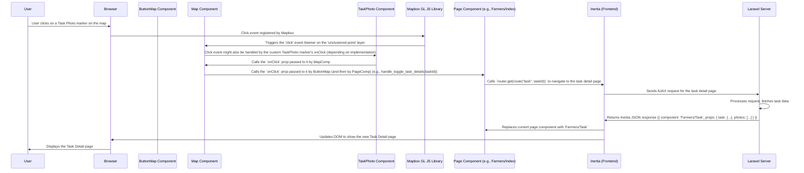

# Chapter 8: Map Components (Mapbox GL JS)

Welcome back! In the last chapter, [Chapter 7: Task Gallery Components](07_task_gallery_components_.md), we explored how to display collections of photos and their associated metadata using the `TaskGallery` and `Modal_` components. While seeing photos is essential, tasks often involve *locations*. Users need to see *where* those photos were taken or *where* a specific task is located.

Displaying geographical data on a traditional web page can be tricky. You need a way to show points on a map, potentially draw shapes or lines, allow zooming and panning, and perhaps switch between different map views (like street or satellite).

### The Problem: Showing Locations on an Interactive Map

Imagine you have a list of tasks, and each task has a location (latitude and longitude) associated with one of its photos. You want to show all these task locations on a map simultaneously so users can see where they are geographically, perhaps cluster nearby points, or click on a point to get more information. Similarly, if a task involved drawing a path or area, you want to display that shape on the map.

Simply embedding a static image of a map isn't interactive. You need a dynamic map that responds to user actions like zooming, panning, and clicking.

### The Solution: Map Components powered by Mapbox GL JS

This is where the **Map Components** come in, powered by the **Mapbox GL JS** library. Mapbox GL JS is a powerful JavaScript library for displaying interactive maps on the web. It uses your graphics card to render maps, making them smooth and fast.

In the `code_to_analyze` project, a set of components work together to integrate this interactive map functionality:

1.  **`Map.tsx`**: This is the core component that initializes the Mapbox map and handles most of the complex logic for adding data (points, paths), adding layers, handling events, and adding controls.
2.  **`ButtonMap.tsx`**: A simple wrapper component that includes the `Map` component and a button to toggle its visibility. This allows pages to show/hide the map easily.
3.  **`TaskPhoto.tsx`**: A small component used to render a custom marker on the map for task locations, showing a miniature photo and task info.
4.  **`CustomPopup.tsx`**: A small component used to render custom content inside a popup that appears when you click on specific elements on the map (like points along a drawn path).
5.  **`ToggleControl.tsx`**: A custom control added directly to the map, allowing users to switch between map styles (street or satellite).

Think of `Map.tsx` as the **digital, interactive globe** itself. `ButtonMap.tsx` is like a stand with a button that lets you open or close the view of the globe. `TaskPhoto.tsx` and `CustomPopup.tsx` are custom pins or labels you can put on the globe. `ToggleControl.tsx` is a special button attached to the globe itself.

### How to Use the Map Components

You'll primarily interact with the map functionality by using the `ButtonMap.tsx` or `Map.tsx` components in your pages.

Let's look at `resources/js/Pages/Farmers/Index.tsx` (the Task list page). It uses `ButtonMap` to show the locations of tasks that have photos:

```typescript
// Snippet from resources/js/Pages/Farmers/Index.tsx
import ButtonMap from "@/Components/Map/ButtonMap"; // Import ButtonMap
import { usePage, router } from "@inertiajs/react"; // Need usePage and router
import { TaskPhotos, PaginatedData, Tasks } from "@/types"; // Need types from Chapter 4

export function Index({ auth }: PageProps) {
    // Get the list of tasks and other data from Inertia props (Chapter 5)
    const { tasks, sortColumn, sortOrder, search, user, selectedStatuses, errors, filtersVal, splitMode } = usePage<{
        tasks: PaginatedData<Tasks>;
        // ... other prop types ...
    }>().props;

    // Prepare the task data specifically for the map.
    // Filter tasks that have photos and format the location.
    const tasks_photos_array: Array<TaskPhotos> = [];
    for (let task of tasks.data) {
        if (task.photos.length > 0) {
            let tasks_photos_data = {
                ...task, // Include task details
                farmer_name: `${auth.user.name} ${auth.user.surname}`,
                photo: task.photos[0], // Use the first photo for location/preview
                // Location needs to be [lng, lat] for Mapbox GeoJSON
                location: [task.photos[0]?.lng, task.photos[0]?.lat],
            };
            tasks_photos_array.push(tasks_photos_data);
        }
    }

    const [filter_tasks_photos, set_filter_tasks_photos] = useState<Array<TaskPhotos>>(tasks_photos_array); // Use state if needed

    // This function is called by the Map component when the map view changes (in unassigned mode)
    const handleZoomFilter = (leaves: String[] | undefined) => {
        // This logic filters the *list* displayed next to the map
        const filteredPhotos = tasks_photos_array.filter((photo) =>
            leaves?.includes(photo.photo.digest)
        );
        // ... update state or perform other actions based on visible items ...
    };

    // This function is called by the Map component when a TaskPhoto marker is clicked
    const handle_toggle_task_details = (taskId: number) => {
        // Navigate to the task detail page using Inertia router (Chapter 5)
        router.get(route("task", taskId));
    };

    return (
        <AuthenticatedLayout /* ... */ >
             {/* ... other page content (like the Table from Chapter 6) ... */}

             {/* Use the ButtonMap component */}
            <ButtonMap
                data={filter_tasks_photos} // Pass the array of tasks with photo locations
                onClick={handle_toggle_task_details} // Pass the handler for marker clicks
                zoomFilter={handleZoomFilter} // Pass the handler for filtering based on map view
                isUnassigned={true} // Pass a flag to indicate unassigned context
            />

            {/* ... rest of page content ... */}
        </AuthenticatedLayout>
    );
}
// ... rest of the component ...
```

**Explanation:**

1.  We import `ButtonMap`.
2.  We retrieve the `tasks` data from `usePage().props` ([Chapter 5](05_data_fetching_and_forms__inertia_.md)).
3.  We process the `tasks` data to create a new array `tasks_photos_array`. Each item in this new array includes only the data needed for the map (`id`, `status`, `photo`, `location`, `farmer_name`). Crucially, the `location` is formatted as `[longitude, latitude]`, which is the standard for Mapbox GeoJSON. We use the `TaskPhotos` [TypeScript type](04_application_data_types__typescript__.md) for this array.
4.  `handleZoomFilter` and `handle_toggle_task_details` are functions defined in the page component that will be passed down to the `ButtonMap` and ultimately the `Map` component as props.
    *   `handleZoomFilter`: This function is designed to receive a list of identifiers (digests) of the photo markers currently visible in the map's view. The page component then uses this list to filter the data shown *elsewhere* on the page (e.g., filtering the table list to only show tasks visible on the map).
    *   `handle_toggle_task_details`: This function takes a `taskId` and uses `router.get` ([Chapter 5](05_data_fetching_and_forms__inertia_.md)) to navigate to the specific task's detail page. This is what happens when you click a task marker on the map.
5.  We render the `<ButtonMap>` component and pass the prepared `tasks_photos_array` to the `data` prop, and our handler functions to the `onClick` and `zoomFilter` props.

The `ButtonMap` component itself is very simple:

```typescript
// Snippet from resources/js/Components/Map/ButtonMap.tsx
import Map from "@/Components/Map/Map"; // Imports the core Map component
import { useState } from "react";
import { MapProps } from "@/types"; // Imports the type definition for Map props
import { FaRegMap } from "react-icons/fa6"; // An icon component

const ButtonMap  = ({
    data,
    onClick,
    isSelected,
    isUnassigned,
    zoomFilter,
}: MapProps) => { // Component receives standard MapProps
    const [isMapVisible, setIsMapVisible] = useState(true); // State to track if map is visible

    // Function to toggle map visibility state
    const handleToggleMapVisibility = () => {
        setIsMapVisible((prevVisibility) => !prevVisibility);
    };

    return (
        <> {/* Use a Fragment to return multiple elements */}
            {/* Container div that controls height and visibility based on state */}
            <div
                className={`overflow-hidden transition-all duration-500 ease ${
                    isMapVisible ? "h-[50vh] opacity-100 visible" : "h-0 opacity-0 invisible"
                }`}
            >
                {/* Render the core Map component */}
                <Map data={data} zoomFilter={zoomFilter} isUnassigned={isUnassigned} onClick={onClick} className="w-full h-3/4-screen"/>
            </div>
            {/* Button to toggle map visibility */}
            <button
                className={`w-full rounded-b-md /* ...styles... */`}
                onClick={handleToggleMapVisibility} // Call the toggle function on click
            >
                <div className="flex items-center justify-center">
                    <span> {/* Map icon */} <FaRegMap className={`icon mr-2`} size={18} /> </span>
                    {/* Button text changes based on map visibility */}
                    {isMapVisible ? "HIDE MAP" : "SHOW MAP"}
                </div>
            </button>
        </>
    );
};

export default ButtonMap;
```

`ButtonMap` simply renders the `Map` component inside a container whose height and visibility are controlled by the `isMapVisible` state. It passes all the props it received (`data`, `onClick`, `zoomFilter`, etc.) down to the `Map` component.

The `resources/js/Pages/Farmers/Paths.tsx` page uses the `Map` component directly (without `ButtonMap`) to display paths:

```typescript
// Snippet from resources/js/Pages/Farmers/Paths.tsx
import Map from "@/Components/Map/Map"; // Import the core Map component
import { usePage } from "@inertiajs/react"; // Need usePage
import { Path, PathFilter } from "@/types"; // Need types from Chapter 4

export function Paths({ auth, paths: initialPaths, splitMode }: PageProps) { // paths prop comes from Inertia

    // State to hold the paths data, potentially filtered
    const [paths_, setPaths] = useState<Array<Path>>([]);
    // State to manage which paths are currently displayed/filtered on the map
    const [filterPaths, setFilterPaths] = useState<PathFilter>({
        data: [], // Array of Path objects to display on map
        filterIds: [], // Array of IDs of paths currently displayed on map
    });

    // Load initial paths into state
    useEffect(() => {
        setPaths(initialPaths);
        // If no filter is active, show all paths initially
        if (filterPaths.filterIds.length === 0) {
            setFilterPaths((item: any) => ({ ...item, data: initialPaths }));
        }
    }, [initialPaths]); // Re-run effect if initial paths from Inertia change

    // Function to handle showing/hiding paths on the map (called by a Checkbox in the Table)
    const handleCheckboxChange = (pathId: any) => {
        // ... logic to update filterPaths state based on checked/unchecked ...
        // This modifies the `filterPaths.data` array which is passed to the Map component
        // ... then update the state using setFilterPaths ...
    };

    // Left pane containing the table (Chapter 6)
    const LeftPane = useCallback(({filterPaths,setFilterPaths}:PropsWithChildren<{filterPaths:PathFilter,setFilterPaths:any}>) => {
        return (
            <div className="/* ...styles... */">
                <Table
                    columns={[
                       // ... other columns ...
                       {
                            label: "Show on map",
                            name: "show",
                            renderCell: (row: Path) => (
                                <label className="flex items-center">
                                    <Checkbox
                                        type="checkbox"
                                        // Checkbox state reflects if this path's ID is in filterPaths.filterIds
                                        checked={filterPaths.filterIds.includes(row.id)}
                                        onChange={() => handleCheckboxChange(row.id)} // Call handler on change
                                    />
                                </label>
                            ),
                        },
                       // ... other columns ...
                       {
                            label: "Actions",
                            name: "action",
                            renderCell: (row: Path) => (
                                <button onClick={() => deletePath(row.id)}> {/* Call delete function from parent */}
                                    <FaTrash /> Delete Path
                                </button>
                            ),
                        },
                    ]}
                    rows={paths_} // Table displays ALL paths from state
                />
            </div>
        );
    }, [paths_, splitView.split, filterPaths.filterIds]); // Dependencies include filterPaths.filterIds

    // Right pane containing the map
    const RightPane = useCallback(({filterPaths}:PropsWithChildren<{filterPaths:PathFilter}>) => {
        return (
            <div className="/* ...styles... */">
                {/* Use the core Map component directly */}
                <Map data={[]} paths={filterPaths.data} className="w-full h-3/4-screen"/> {/* Pass the filtered paths */}
            </div>
        );
    }, [splitView.split, filterPaths.data]); // Dependencies include filterPaths.data

    return (
        <AuthenticatedLayout /* ... */ >
            <Head title="Paths" />
            <BackButton label="Back" />
            <div className="flex flex-wrap">
                 {/* Render LeftPane (Table) and RightPane (Map) */}
                {splitView.split ? (
                    <> <LeftPane filterPaths={filterPaths} setFilterPaths={setFilterPaths}/> <RightPane filterPaths={filterPaths} /> </>
                ) : (
                    <> <RightPane filterPaths={filterPaths}/> <LeftPane filterPaths={filterPaths} setFilterPaths={setFilterPaths}/> </>
                )}
            </div>
        </AuthenticatedLayout>
    );
}
// ... rest of component ...
```

Here, the `Paths` page component:
1.  Gets the initial `paths` data via `usePage().props` from Inertia.
2.  Manages which paths should be shown on the map using the `filterPaths` state.
3.  Uses the `Table` component ([Chapter 6](06_data_table_component_.md)) to display *all* paths but adds a `renderCell` with a `Checkbox` to control which paths are added to the `filterPaths.data` array.
4.  Renders the `Map` component directly in the `RightPane`, passing the `filterPaths.data` array to the `paths` prop. It passes an empty array to `data` because this page doesn't show individual task photo markers.

These examples show that you use `ButtonMap` (or `Map`) and pass the relevant geographical data (`data` for points, `paths` for paths) as props, along with any handler functions you want the map to call when the user interacts with it (`onClick`, `zoomFilter`).

### Inside the `Map.tsx` (Simplified)

The `Map.tsx` component is where the Mapbox GL JS magic happens. It's a React component that manages the lifecycle of the Mapbox map instance.

```typescript
// Snippet from resources/js/Components/Map/Map.tsx
import { useRef, useEffect, useState, memo } from "react";
import mapboxgl, { LngLat, LngLatLike, IControl, Map as MapboxMap } from "mapbox-gl"; // Import Mapbox GL JS types and classes
import "mapbox-gl/dist/mapbox-gl.css"; // Import default Mapbox styles
import "./map.css"; // Import custom styles
import ToggleControl from "./ToggleControl"; // Custom control component
import { createRoot } from "react-dom/client"; // Needed to render React into DOM elements for markers/popups
import TaskPhoto from "./TaskPhoto"; // Custom marker component
import CustomPopup from "./CustomPopup"; // Custom popup content component
import { MapProps, Path, TaskPhotos } from "@/types"; // Import data types from Chapter 4

function Map({
    data, // Array of TaskPhotos (points)
    onClick, // Handler for point marker clicks
    paths, // Array of Path objects
    zoomFilter, // Handler for map movement filtering
    className,
    style
}: MapProps) {
    // Refs to hold the Mapbox map instance and the container div
    const mapRef = useRef<mapboxgl.Map | null>(null);
    const mapContainerRef = useRef<HTMLDivElement>(null);
    const markerRef = useRef<any>([]); // Ref to store custom React markers

    // State for the map style (street/satellite), initialized from local storage
    const [mapStyle, setMapStyle] = useState(() => {
        const savedStyle = localStorage.getItem(MAP_STYLE_KEY);
        return savedStyle || "mapbox://styles/mapbox/streets-v11"; // Default to street style
    });

    // Handlers to change map style state and save to local storage
    const mapViewClickHandler = () => { setMapStyle("mapbox://styles/mapbox/streets-v11"); localStorage.setItem(MAP_STYLE_KEY, "mapbox://styles/mapbox/streets-v11"); };
    const satelliteViewClickHandler = () => { setMapStyle("mapbox://styles/mapbox/satellite-v9"); localStorage.setItem(MAP_STYLE_KEY, "mapbox://styles/mapbox/satellite-v9"); };

    // Create an instance of our custom ToggleControl
    const toggleControl = new ToggleControl({
        onMapViewClick: mapViewClickHandler,
        onSatelliteViewClick: satelliteViewClickHandler,
    });

    // Effect hook to initialize and manage the Mapbox map lifecycle
    useEffect(() => {
        mapboxgl.accessToken = import.meta.env.VITE_MAPBOX_TOKEN; // Set your Mapbox access token

        // Try to load saved map position/zoom from local storage
        const savedZoom = localStorage.getItem(MAP_ZOOM_KEY);
        const savedCenter = localStorage.getItem(MAP_CENTER_KEY);
        let initialCenter: [number, number] = [0.166022, 51.288998]; // Default center (UK)
        let initialZoom = 2.7; // Default zoom
        // Use saved position if available and not coming from photo detail page redirect
        const fromPhotoDetail = localStorage.getItem(MAP_FROM_PHOTO_DETAIL) === "true";
        if (!fromPhotoDetail && savedCenter && savedZoom) {
             try { initialCenter = JSON.parse(savedCenter); initialZoom = parseFloat(savedZoom); } catch (e) { console.error("Error parsing saved map position", e); }
        } else if (fromPhotoDetail) {
            // If returning from photo detail, *always* use saved position if available
             if (savedCenter && savedZoom) {
                 try { initialCenter = JSON.parse(savedCenter); initialZoom = parseFloat(savedZoom); } catch (e) { console.error("Error parsing saved map position", e); }
             }
            // Reset the flag after a short delay
             setTimeout(() => { localStorage.setItem(MAP_FROM_PHOTO_DETAIL, "false"); }, 500);
        }

        // --- Initialize the Mapbox Map ---
        mapRef.current = new mapboxgl.Map({
            container: mapContainerRef.current!, // The HTML element the map will be rendered in
            style: mapStyle, // The current map style URL
            center: initialCenter, // Initial center coordinates [lng, lat]
            zoom: initialZoom, // Initial zoom level
            maxBounds: [
                [-180, -85], [180, 85], // Prevent panning outside this range
            ],
        });

        // Add navigation control (zoom buttons, compass)
        mapRef.current.addControl(new mapboxgl.NavigationControl());
         // Add our custom style toggle control
        mapRef.current.addControl(toggleControl, "top-left"); // Add to top-left corner

        // Add data (points or paths) once the map style is loaded
        mapRef.current.on("style.load", () => {
            if (paths && paths.length > 0) {
                // If 'paths' data is provided, load and display paths
                 // Fit bounds to paths unless returning from photo detail
                if (!fromPhotoDetail) {
                    let bounds = calculateBoundingBox(paths.flatMap(p => p.points.map(pt => [pt.lng, pt.lat])));
                    if(bounds) mapRef.current?.fitBounds(bounds, { padding: 60, duration: 0 });
                }
                paths.forEach((path) => loadPaths(path)); // Call function to add each path
            } else if (data && data.length > 0) {
                // If 'data' (task photos) is provided, load and display markers
                loadClustersAndImage(); // Call function to add markers (with clustering)
                // Fit bounds to points unless returning from photo detail
                if (!fromPhotoDetail) {
                    let bounds = calculateBoundingBox(data.map(task => task.location));
                    if (data.length === 1 && bounds) {
                         mapRef.current?.fitBounds(bounds, { padding: 60, duration: 0, zoom: 16 });
                    } else if (data.length > 0 && bounds) {
                         mapRef.current?.fitBounds(bounds, { padding: 120, duration: 0 });
                    }
                }
            }
        });

        // Event listener to save map position when movement ends
        mapRef.current.on("moveend", () => { saveMapPosition(); });

        // Cleanup function: runs when the component unmounts or effect dependencies change
        return () => {
            saveMapPosition(); // Save position before removing
            mapRef.current?.remove(); // Remove the map instance
        };
    }, [mapStyle, data, paths]); // Dependencies: re-run effect if mapStyle, data, or paths props change

    // --- Functions to load different data types onto the map ---

    // Loads clusters and individual markers for task photos/locations
    const loadClustersAndImage = () => {
        // ... Mapbox GL JS logic for adding GeoJSON source ('tasks_photos')
        // ... Mapbox GL JS logic for adding layers ('clusters', 'unclustered-point') based on the source
        // ... Mapbox GL JS logic for loading custom marker images based on task status
        // ... Event listeners for 'click' on 'clusters' (zoom in)
        // ... Event listeners for 'click' on 'unclustered-point' (zoom to point)
        // ... Event listener for 'moveend' to trigger zoomFilter prop (if isUnassigned)
        // ... Event listener for 'zoom' to update marker visibility/clustering
    };

    // Adds a single custom React marker for a TaskPhoto
    const addMarkers = (data_: TaskPhotos) => {
        const el = document.createElement("div"); // Create a standard HTML div
        const root = createRoot(el); // Create a React root in the div
        // Render the TaskPhoto React component into the div, passing data and click handler prop
        root.render(<TaskPhoto data={data_} onClick={onClick} />);
        // Create a Mapbox Marker using the custom HTML element and set its location
        const marker = new mapboxgl.Marker(el).setLngLat(data_?.location);
        // Store the marker instance so we can remove it later
        markerRef.current.push(marker);
    };

     // Helper to calculate bounding box from coordinates
    const calculateBoundingBox = (coordinates: Array<[number, number]>|any) => {
        // ... logic to calculate the min/max lat/lng from an array of points ...
        // Returns a mapboxgl.LngLatBounds object or null
         if (!coordinates || coordinates.length === 0) return null;
         // Filter invalid coordinates
         const validCoords = coordinates.filter((coord:any) => coord && coord.length === 2 && coord[1] >= -90 && coord[1]  <= 90 && coord[0] >= -180 && coord[0] <= 180);
         if (validCoords.length === 0) return null;
         let bounds = new mapboxgl.LngLatBounds(validCoords[0], validCoords[0]);
         validCoords.forEach((coord:any) => { bounds.extend(coord); });
         return bounds;
    };


    // Loads and displays a single path (polygon with outline and points)
    const loadPaths = (path: Path) => {
        const coordinates = path?.points.map((point) => [ parseFloat(point.lng.toString()), parseFloat(point.lat.toString()), ]);

        // Add the first point again to close the polygon path
        coordinates.push(coordinates[0]);

        // --- Add GeoJSON Source for the path ---
        mapRef.current?.addSource(path.id.toString(), {
            type: "geojson",
            data: { type: "Feature", geometry: { type: "Polygon", coordinates: [coordinates] }, properties: {}, },
        });

        // --- Add Layer for Polygon Fill ---
        mapRef.current?.addLayer({
            id: path.id.toString(), // Unique ID for the layer
            type: "fill", // Type of visualization
            source: path.id.toString(), // Reference the source data
            paint: { "fill-color": "#9a97f2", "fill-opacity": 0.2, }, // Styling (blue fill, semi-transparent)
        });

        // --- Add Layer for Polygon Outline ---
        mapRef.current?.addLayer({
            id: `outline_${path.id}`, type: "line", source: path.id.toString(),
            paint: { "line-color": "#0401fc", "line-width": 2, }, // Styling (blue line, 2px wide)
        });

         // --- Add GeoJSON Source for Path Points ---
         const pointFeatures: any = path.points.map( (coord: any, index: number) => ({ type: "Feature", geometry: { type: "Point", coordinates: [coord.lng, coord.lat], }, properties: { details: JSON.stringify(coord), points: index + 1, }, }) ); // Store point details and index in properties
         mapRef.current?.addSource(`points_${path.id}`, { type: "geojson", data: { type: "FeatureCollection", features: pointFeatures, }, });

         // --- Add Layer for Path Points as Circles ---
         mapRef.current?.addLayer({
             id: `circles_${path.id}`, type: "circle", source: `points_${path.id}`,
             paint: { "circle-radius": 5, "circle-color": "#0401fc", "circle-stroke-width": 1, "circle-opacity": 0.8, "circle-stroke-color": "#0401fc", }, // Styling (blue circles)
         });


        // --- Add Click Event Listeners for Paths and Points ---
         // Clicking the polygon or outline changes its color
        mapRef.current?.on("click", path.id.toString(), () => { /* ... change layer paint properties to yellow ... */ });
         // Clicking the map outside the polygon resets its color
        mapRef.current?.on("click", (e: any) => { /* ... check if click was on layer, if not, reset colors ... */ });

        // Clicking a path point (circle) shows a popup
        mapRef.current?.on("click", `circles_${path.id}`, (e: any) => {
             const coordinates = e.features[0].geometry.coordinates.slice(); // Get coordinates from clicked feature
             const properties = e.features[0].properties; // Get properties
             const details = JSON.parse(properties.details); // Parse details from stored properties
             const points = properties.points;

             // Create a DOM element for the popup content
             const el: any = document.createElement("div");
             const root = createRoot(el); // Create a React root
             // Render the CustomPopup React component into the div
             root.render( <CustomPopup points={points} pathText={path.name} latitude={details.lat} longitude={details.lng} altitude={details.altitude} accuracy={details.accuracy} time={details.created} /> );

             // Create a Mapbox Popup instance
             const popup = new mapboxgl.Popup({ maxWidth: "320px" })
                 .setLngLat(coordinates) // Position the popup at the clicked coordinates
                 .setDOMContent(el) // Set the content using the HTML element with our React component
                 .addTo(mapRef.current!); // Add the popup to the map
         });

         // --- Add Custom Text Label (Marker) for the Path Name ---
         const firstPoint: any = coordinates[0]; // Get the first point of the path
         const textBox = document.createElement("div"); // Create HTML div for the label
         textBox.textContent = path.name; // Set the text
         // ... apply styles to textBox (background, border, font, etc.) ...

         // Create a Mapbox Marker using the custom HTML element
         if (firstPoint[1] >= -90 && firstPoint[1] <= 90 && firstPoint[0] >= -180 && firstPoint[0] <= 180) {
             const marker = new mapboxgl.Marker({ element: textBox, anchor: "bottom", }) // Use the div as element, anchor bottom
                 .setLngLat(firstPoint) // Position at the first point
                 .addTo(mapRef.current!); // Add to map
         }

    };

    // This function renders the main map container div
    return (
        <div
            id="map-container" // ID for the container
            className={className} // Apply class names from props
            style={style} // Apply styles from props
            ref={mapContainerRef} // Attach ref to link with Mapbox initialization
        />
    );
}

export default memo(Map); // Memoize the component for performance
```

**Explanation:**

1.  **`useRef`**: `mapRef` and `mapContainerRef` are used to hold references to the Mapbox map instance and the HTML div element where the map will be rendered, respectively. `markerRef` stores references to custom HTML markers we create.
2.  **`useState`**: `mapStyle` manages the current map style (street or satellite), and `setMapStyle` is the function to change it. Initial style is read from browser `localStorage`.
3.  **`ToggleControl`**: An instance of our custom `ToggleControl` class is created, passing the `mapViewClickHandler` and `satelliteViewClickHandler` functions.
4.  **`useEffect`**: This is crucial.
    *   It runs once when the component mounts (`[]` dependency array, but here includes `mapStyle`, `data`, `paths`).
    *   Inside, it initializes Mapbox GL JS (`mapboxgl.accessToken = ...`, `new mapboxgl.Map({...})`), attaching the map to the `mapContainerRef` div. It uses the current `mapStyle` and tries to load the last saved center/zoom from `localStorage`.
    *   It adds standard Mapbox controls (`NavigationControl`) and our custom `toggleControl`.
    *   It adds event listeners to the map instance, like `moveend` to save the position and `style.load` to add data sources and layers once the map style is ready.
    *   The `return` function within `useEffect` is the cleanup function. It saves the map position and removes the Mapbox map instance when the component unmounts or the dependencies change, preventing memory leaks.
5.  **`loadClustersAndImage`**: This function (simplified in the snippet) adds GeoJSON sources and layers to display task locations. It configures clustering (`cluster: true`) so that nearby points are grouped together as numbered circles at lower zoom levels, and individual markers are shown at higher zoom levels. It uses custom images for different task statuses. It also adds `click` listeners to these layers to handle user interaction (zooming in on clusters, or triggering the `onClick` prop for individual markers).
6.  **`addMarkers`**: This helper function demonstrates how to put a custom React component (`TaskPhoto`) onto the Mapbox map as a marker. It creates a standard HTML `div`, uses `createRoot` from `react-dom/client` to render the React component into that `div`, and then creates a `mapboxgl.Marker` instance using the `div` as the `element`.
7.  **`loadPaths`**: This function handles displaying the `paths` data.
    *   It adds a GeoJSON source for the path coordinates, formatted as a Polygon.
    *   It adds two layers referencing this source: a `'fill'` layer for the polygon area and a `'line'` layer for the outline.
    *   It adds *another* GeoJSON source specifically for the *points* of the path.
    *   It adds a `'circle'` layer referencing the points source to draw small circles at each point along the path.
    *   It adds `click` listeners to the polygon/outline layers (changing color) and the points layer (showing a popup).
    *   For the point click listener, it retrieves the coordinates and stored details (from the GeoJSON feature properties), creates a standard HTML `div`, uses `createRoot` to render the `CustomPopup` React component into that `div`, and creates a `mapboxgl.Popup` instance using the `div` as the `setDOMContent`.
    *   It also adds a custom text label (using a `mapboxgl.Marker` with a custom HTML element) at the start of the path.
8.  **`calculateBoundingBox`**: A helper function to determine the geographical bounds containing all the provided coordinates. Used to automatically zoom the map to fit the data.
9.  **Return Value**: The component returns a simple `div` element (`mapContainerRef`) which acts as the container for the Mapbox map. Mapbox GL JS takes over this div and fills it with the interactive map.

This shows that `Map.tsx` is a bridge between React's component lifecycle and state management, and the imperative API of the Mapbox GL JS library. It manages the Mapbox map instance, adds data sources and layers, and hooks up Mapbox events to trigger actions or call prop functions provided by the parent component.

### How Map Components Work Together (Sequence Diagram)

Let's trace what happens when you click a task photo marker on the map displayed by `ButtonMap`/`Map`:



This diagram illustrates how a user action on the map (handled by Mapbox and wrapped by our components) flows back up through the component hierarchy to trigger an Inertia navigation action defined in the page component.

### Conclusion

In this chapter, we learned about the **Map Components**, primarily `Map.tsx` and its helper components (`ButtonMap.tsx`, `TaskPhoto.tsx`, `CustomPopup.tsx`, `ToggleControl.tsx`). We saw how they integrate interactive maps using Mapbox GL JS to display geographical data like task locations and drawn paths. We explored how pages provide the data and define how user interactions (like clicking a marker) should be handled by passing props to these components. We also got a glimpse inside `Map.tsx` to understand how it initializes the Mapbox map, adds data sources and layers, handles events, and incorporates custom React elements for markers and popups.

Understanding these components is key to navigating the parts of the application that deal with spatial visualization of task data.

Next, we'll move on to how the application generates PDF reports directly within the browser, covering [PDF Renderer (Client-side)](09_pdf_renderer__client_side_.md).

---

Generated by [AI Codebase Knowledge Builder](https://github.com/The-Pocket/Tutorial-Codebase-Knowledge)