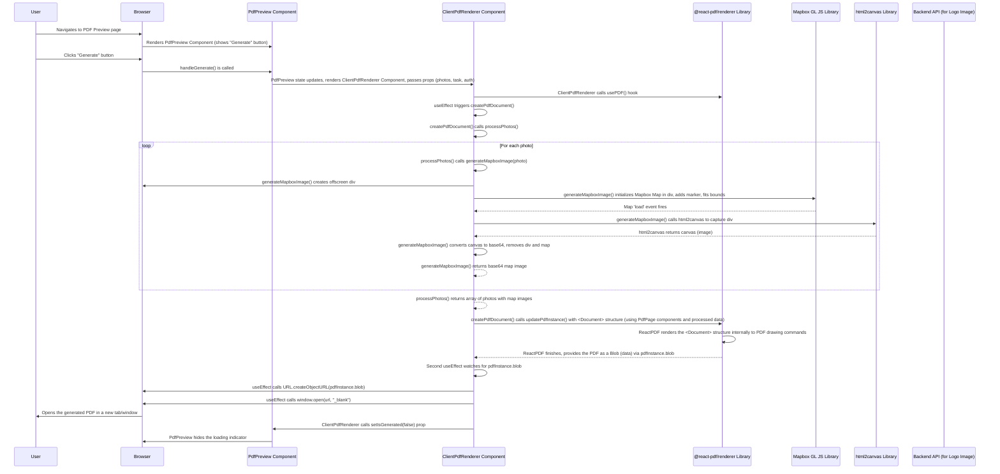

# Chapter 9: PDF Renderer (Client-side)

Welcome back! In our journey so far, we've learned how to structure our application with the [Authenticated Layout](01_authenticated_layout_.md), handle pages and data with [Inertia.js](02_inertia_js_page_structure_.md) and [TypeScript types](04_application_data_types__typescript__.md), build user interfaces with [React Components](03_react_components_.md), manage data flow and forms with [Inertia hooks](05_data_fetching_and_forms__inertia__.md), display lists in a [Data Table](06_data_table_component_.md), and even visualize photos and locations using the [Task Gallery](07_task_gallery_components_.md) and [Map Components](08_map_components__mapbox_gl_js__.md).

All of these components display information *within* the web application itself. But what if you need to create a shareable, printable document – like a report summarizing task details, photos, and maps? Traditionally, creating such documents on a server requires complex libraries and server resources. This can add load to the server and might be slower than desired.

### The Problem: Generating Printable Documents

Imagine a user has selected several photos from a task or the unassigned photo gallery and wants to generate a PDF report containing each photo, its metadata, and a small map showing where it was taken. Doing this on the server would mean sending all the selected photos and data to the backend, the backend generating the PDF file, and then sending the file back to the browser for download. This works, but it adds unnecessary load and complexity to the server.

### The Solution: Client-side PDF Rendering

This is where **Client-side PDF Rendering** comes in. Instead of relying on the server, we can leverage the user's own browser to generate the PDF document directly using the data already available in the application.

The `code_to_analyze` project uses the `@react-pdf/renderer` library for this. Think of this library as a **special kind of printing press built into your browser**. You provide it with the content you want in your PDF (text, images, layout instructions), and it outputs a PDF file.

The cool part is that `@react-pdf/renderer` lets you define the structure and content of your PDF using **React components**, just like building your web UI! You use components like `Document`, `Page`, `View`, `Text`, and `Image`, but instead of rendering to HTML, they render to PDF elements.

This approach keeps the PDF generation logic in the frontend, reducing server load and potentially offering a faster experience for the user, especially when dealing with data already loaded in the browser.

The main components involved are:
1.  **`PdfPreview.tsx`**: This component acts as the preview screen and the trigger for generating the PDF.
2.  **`ClientPdfRenderer.tsx`**: This component uses `@react-pdf/renderer` to actually define and generate the PDF content.

### Use Case: Generating a Photo Report PDF

Let's focus on the use case of generating a PDF report for selected photos, which might include details like the task name (if applicable), photo metadata, the photo itself, and a small map showing the photo's location. The `resources/js/Pages/Farmers/PdfPreview.tsx` file handles this.

When you select photos (e.g., from the Task detail page or Photo Gallery) and initiate the PDF generation process (often via a backend route that redirects to `PdfPreview.tsx` with the selected photo IDs), the server renders the `PdfPreview.tsx` page using Inertia ([Chapter 2: Inertia.js Page Structure](02_inertia_js_page_structure_.md)), passing the selected `photos` data as props ([Chapter 5: Data Fetching and Forms (Inertia)](05_data_fetching_and_forms__inertia_.md)).

#### 1. The `PdfPreview.tsx` Component (The Trigger)

The `PdfPreview.tsx` component is fairly simple. It receives the `photos` data and potentially `tasks` and `auth` user info via Inertia props (`usePage().props`, [Chapter 5](05_data_fetching_and_forms__inertia_.md), [Chapter 4](04_application_data_types__typescript__.md)). It displays a "Generate" button and, before generation, might show a preview structure (though the code snippet seems to omit a detailed preview and jumps straight to the generator state).

Let's look at a simplified version:

```typescript
// Snippet from resources/js/Pages/Farmers/PdfPreview.tsx
import { PageProps, Photo, Task } from "@/types"; // Import types
import { memo, useEffect, useState } from "react";
import ClientPdfRenderer from "@/Components/Pdf/ClientPdfRenderer"; // Import the renderer component

export function PdfPreview({ tasks, photos, auth, total }: PageProps) {
    // State to control whether the PDF generator is currently active
    const [isGenerate, setIsGenerated] = useState(false);

    // Function called when the "Generate" button is clicked
    async function handleGenerate() {
        setIsGenerated(true); // Set state to true, which will render the generator
    }

    return (
        <div className="/* ...styles... */">
            {/* Conditionally render the ClientPdfRenderer based on the state */}
            {isGenerate ? (
                // Render the actual PDF renderer
                <ClientPdfRenderer
                    isPhotoGallery={tasks.length === 0} // Pass flag if it's a gallery export
                    setIsGenerated={setIsGenerated} // Pass state setter back (to hide loader later)
                    photos={photos} // Pass the photo data to be included in the PDF
                    task={tasks.length > 0 ? tasks[0] : null} // Pass task data if available
                    auth={auth} // Pass auth user data for header/details
                    totalPages={total} // Pass total count for numbering
                />
            ) : (
                <> {/* Content shown BEFORE generating */}
                    <h2 className="/* ...styles... */">
                        Generating of PDF document
                    </h2>
                    <div className="/* ...styles... */">
                        <button
                            type="button"
                            className="/* ...styles... */"
                            onClick={handleGenerate} // Click calls handleGenerate
                        >
                            Generate
                        </button>
                    </div>
                    {/* Optionally, render preview elements here (omitted for brevity/focus) */}
                    {/* photos.map((photo, index) => { return getContent(photo, index); }) */}
                </>
            )}
        </div>
    );
}
export default memo(PdfPreview);
```

**Explanation:**

1.  `useState(false)`: We use state to track if the generation process has started. Initially, `isGenerate` is `false`.
2.  `handleGenerate()`: This function simply sets `isGenerate` to `true`.
3.  Conditional Rendering: The JSX uses a ternary operator (`isGenerate ? (...) : (...)`) to decide what to render.
    *   If `isGenerate` is `false` (initially), it shows the "Generating PDF" title and the "Generate" button.
    *   If `isGenerate` becomes `true` (after clicking the button), it renders the `<ClientPdfRenderer>` component.
4.  `<ClientPdfRenderer>` Props: When rendering `ClientPdfRenderer`, we pass all the data needed to build the PDF (`photos`, `task`, `auth`, `totalPages`) as props. This makes `ClientPdfRenderer` a reusable component that doesn't need to fetch data itself; it just uses what's given.

This setup is simple: the `PdfPreview` component acts as a gatekeeper, waiting for the user to confirm generation before loading the heavyweight `ClientPdfRenderer`.

#### 2. The `ClientPdfRenderer.tsx` Component (The Generator)

This is where the main logic for creating the PDF lives, using the `@react-pdf/renderer` library.

Key parts of this component are:
*   Using the `usePDF` hook.
*   Defining the PDF structure using `@react-pdf/renderer` components (`Document`, `Page`, `View`, `Text`, `Image`, `StyleSheet`).
*   Preparing the data, including generating map snapshots.
*   Triggering the PDF generation and opening the result.

```typescript
// Snippet from resources/js/Components/Pdf/ClientPdfRenderer.tsx
import React, { PropsWithChildren, useEffect } from "react";
import {
    usePDF, // The hook from @react-pdf/renderer
    Document, // The root component for the PDF
    Page, // Defines a single page
    Text, // Renders text
    View, // Like a div for layout
    StyleSheet, // For PDF-specific styling
    Image, // Renders images
    // ... other components like Line, Font
} from "@react-pdf/renderer";
import mapboxgl from "mapbox-gl"; // Needed for map snapshot
import html2canvas from "html2canvas"; // Needed to capture map as image
import { createRoot } from "react-dom/client"; // Needed to render React components *into* the Mapbox map for snapshots
import TaskPhoto from "../Map/TaskPhoto"; // Reused Map component for snapshot marker
import moment from "moment"; // For date formatting
import { Photo, Task, User } from "@/types"; // Import types

// Define PDF styles using StyleSheet.create (similar to CSS but PDF-specific)
const styles = StyleSheet.create({
    page: { /* ...styles for the whole page (padding, font) ... */ },
    header: { /* ...styles for the header view (logo, title) ... */ },
    image_brand: { /* ...styles for the logo image ... */ },
    title: { /* ...styles for the main title ... */ },
    second_header: { /* ...styles for export date/page count ... */ },
    task_title: { /* ...styles for the main task name title ... */ },
    task_list_container: { /* ...styles for task detail layout ... */ },
    task_container: { /* ...styles for individual task detail items ... */ },
    task_heading: { /* ...styles for task detail labels ... */ },
    task_value: { /* ...styles for task detail values ... */ },
    task_image: { /* ...styles for the main photo image ... */ },
    bottom_container: { /* ...styles for map + photo details section ... */ },
    map_image: { /* ...styles for the map snapshot image ... */ },
    photo_details: { /* ...styles for the photo metadata section ... */ },
    photo_details_row: { /* ...styles for each metadata row ... */ },
    photo_details_value: { /* ...styles for metadata values ... */ },
    footer: { /* ...styles for the footer (page number) ... */ },
    pageNumber: { /* ...styles for the page number text ... */ },
});

// Define the component structure for *one* page of the PDF
const PdfPage = ({
    photo, // Data for the photo on this page
    totalPages,
    isPhotoGallery,
    task,
    auth,
    exportedPages,
    photoKey,
}: PropsWithChildren<{
    photoKey: number;
    photo: Photo;
    totalPages: number;
    isPhotoGallery: boolean;
    task: Task;
    exportedPages: number;
    auth: { user: User };
}>) => {
    const formattedDate = moment().format("YYYY-MM-DD HH:mm:ss");
    return (
        <Page size="A4" style={styles.page}> {/* Start a new A4 page with defined styles */}
            {/* Header Section */}
            <View style={styles.header}>
                <Image src="/logo_egnss4all_white.png" style={styles.image_brand}/>
                <Text style={styles.title}>PIC2BIM export</Text>
                {/* ... subtitle with user/task name ... */}
            </View>

            {/* Content Section */}
            <View style={styles.content}>
                {/* ... Second header with export date and count ... */}
                 {/* ... Main task title (only on first page if needed) ... */}
                 {/* ... Task details container (if not photo gallery) ... */}

                {/* Main Photo Image */}
                {/* Note: photo.link is the URL for the full image. photo.img is likely base64 data prepared earlier */}
                {photo?.img && (<Image src={photo.link} style={styles.task_image} />)}

                {/* Bottom Section (Map + Photo Details) */}
                <View style={styles.bottom_container}>
                     {/* Map Snapshot Image */}
                     {/* photo.mapImg is base64 map image data prepared earlier */}
                    <Image src={photo.mapImg} style={styles.map_image} />
                    {/* Photo Metadata Details */}
                    <View style={styles.photo_details}>
                        {/* Use Photo data to render details */}
                        <View style={styles.photo_details_row}>
                            <Text>Latitude</Text>
                            <Text style={styles.photo_details_value}>{photo?.lat}</Text>
                        </View>
                        {/* ... render other photo properties (lng, altitude, device, accuracy, etc.) ... */}
                         <View style={styles.photo_details_row}>
                            <Text>Timestamp (UTC)</Text>
                            <Text style={styles.photo_details_value}>{photo.timestamp}</Text>
                        </View>
                         <View style={styles.photo_details_row}>
                            <Text>Created(UTC) </Text>
                            <Text style={styles.photo_details_value}>{photo?.created}</Text>
                        </View>
                         {/* ... render verification/original status text ... */}
                    </View>
                </View>
            </View>

            {/* Footer Section (Page Number) */}
            <View style={styles.footer}>
                 <View style={styles.footerLine} />
                <Text style={styles.pageNumber} render={({ pageNumber, totalPages }) => `${pageNumber}/${totalPages}`} fixed/>
            </View>
        </Page>
    );
};

// The main ClientPdfRenderer component
const ClientPdfRenderer = ({
    setIsGenerated, // State setter from parent to hide loader
    isPhotoGallery, // Flag from parent
    photos, // Array of photos from parent
    totalPages, // Total count from parent
    auth, // Auth user data from parent
    task, // Task data from parent
}: PropsWithChildren<{
    setIsGenerated: any;
    photos: Array<Photo>;
    totalPages: number;
    isPhotoGallery: boolean;
    task: Task | null;
    auth: { user: User };
}>) => {
    // usePDF hook: Initializes PDF instance and provides update function
    const [pdfInstance, updatePdfInstance] = usePDF();

    // Function to process each photo (including getting map snapshot)
    const processPhotos = async () => {
        // Map over photos array
        const processedPages = await Promise.all(
            photos.map(async (photo, index: any) => {
                // Example: Add image data if needed (though link prop is used in PdfPage)
                // var img = `data:image/jpeg;base64,${photo?.photo}`; // This could add the actual base64 image data

                // Prepare data specifically for map snapshot generation
                const tasks_photo_for_map: { photo: Photo; location: number[]; name?: string; farmer_name: string; } = {
                    farmer_name: `${auth.user.name} ${auth.user.surname}`,
                    photo: photo,
                    location: [photo?.lng, photo.lat], // Mapbox expects [lng, lat]
                };
                if(task) tasks_photo_for_map.name = task.name;

                // --- GENERATE MAP SNAPSHOT ---
                // This is the complex step that takes a picture of the map for this location
                let mapImageBase64 = await generateMapboxImage(tasks_photo_for_map, 350, 400);

                // Return the photo data extended with the generated map image
                return { ...photo, mapImg: `data:image/png;base64,${mapImageBase64}` }; // Add base64 map image
            })
        );
        return processedPages; // Return array of photos with mapImg added
    };

    // Define the structure of the full PDF document
    const createPdfDocument = async () => {
        const pagesData = await processPhotos(); // Get processed data

        let name = `${moment().format("YYYY.M.D")}_${auth.user.name} ${auth.user.surname} ${ !isPhotoGallery ? "- task detail " + task?.name : "Gallery of unassigned photos"} `;

        // Define the Document structure using @react-pdf/renderer components
        const pdfDocument = (
            <Document title={name + ".pdf"}> {/* Root PDF document component */}
                {/* Map over the processed photo data to create a PdfPage for each */}
                {pagesData.map((photoData, index: any) => (
                     <PdfPage
                        key={index}
                        photoKey={index}
                        photo={photoData} // Pass the processed photo data (including mapImg)
                        totalPages={totalPages}
                        isPhotoGallery={isPhotoGallery}
                        auth={auth}
                        task={task!} // Task is guaranteed by logic in PdfPreview, hence !
                        exportedPages={pagesData.length} // Use actual number of processed pages
                    />
                ))}
            </Document>
        );

        // Update the usePDF instance with the created document
        updatePdfInstance(pdfDocument);
    };

    // Effect hook to trigger PDF document creation when the component mounts
    useEffect(() => {
        createPdfDocument();
    }, []); // Empty dependency array: run only once on mount

    // Effect hook to watch for the PDF blob being generated
    useEffect(() => {
        // Check if the blob is ready and not loading
        if (pdfInstance.blob && !pdfInstance.loading) {
            // Create a URL for the generated PDF blob
            const url = URL.createObjectURL(pdfInstance.blob);
            // Open the PDF in a new browser tab
            window.open(url, "_blank");
            // Tell the parent component (PdfPreview) to hide the loader
            setIsGenerated(false);
        }
    }, [pdfInstance.blob, pdfInstance.loading]); // Dependencies: re-run when blob or loading state changes

    // --- COMPLEX PART: Generating Mapbox Image Snapshots ---
    const generateMapboxImage = async (
        map_tasks_array: { photo: Photo; location: number[]; name?: string; farmer_name: string; },
        width: number,
        height: number
    ): Promise<string> => {
        // 1. Create a temporary, offscreen HTML div
        const container = document.createElement("div");
        container.style.width = `${width}px`;
        container.style.height = `${height}px`;
        container.style.position = "absolute";
        container.style.top = "-9999px"; // Position offscreen
        document.body.appendChild(container);

        // 2. Initialize a Mapbox map inside the temporary div
        const map = new mapboxgl.Map({
            container: container,
            style: "mapbox://styles/mapbox/streets-v11", // Use a standard map style
            center: map_tasks_array.location, // Center map on the photo location
            zoom: 15, // Zoom level for snapshot
            preserveDrawingBuffer: true, // **CRITICAL** for capturing the canvas as image
        });

        // 3. Wait for the map to load and add a marker
        await new Promise<void>((resolve) =>
            map.on("load", () => {
                // Create a custom React marker using TaskPhoto component
                const el = document.createElement("div");
                const root = createRoot(el);
                root.render(<TaskPhoto data={map_tasks_array} />); // Render TaskPhoto component into the div
                const marker = new mapboxgl.Marker(el).setLngLat(map_tasks_array.location);
                marker.addTo(map); // Add the marker to the map

                // Fit bounds to the single point (with padding)
                let bounds = new mapboxgl.LngLatBounds(map_tasks_array.location, map_tasks_array.location);
                map.fitBounds(bounds, {
                    padding: { top: 60, bottom: 60, left: 20, right: 20 },
                    duration: 0, linear: true
                });

                // Resolve the promise after a slight delay to ensure marker is rendered
                setTimeout(() => resolve(), 100); // Small delay
            })
        );

        // 4. Use html2canvas to capture the content of the container div
        const canvas = await html2canvas(container, { useCORS: true }); // useCORS might be needed for external images/fonts

        // 5. Convert the canvas to a base64 image
        const imgData = canvas.toDataURL("image/png");

        // 6. Clean up the temporary div and Mapbox map instance
        map.remove();
        container.parentNode?.removeChild(container);

        // Return the base64 image data (without the prefix)
        return imgData.replace(/^data:image\/\w+;base64,/, "");
    };

     // Helper to calculate bounding box (used by generateMapboxImage)
    const calculateBoundingBox = (coordinates: any) => {
        // ... logic to calculate bounds ...
         let bounds = new mapboxgl.LngLatBounds(coordinates[0], coordinates[0]);
        coordinates.forEach((coord: any) => {
            bounds.extend(coord);
        });
        return bounds;
    };

    // This component itself renders a loading indicator while the PDF is generating
    return (
        <>
            <div style={{ backgroundColor: "#fffffffc", height: "100vh" }}>
                <div className="pdf_loader ">
                    <div className="inner_cont">
                        <p>{/* ... progress indicator text ... */}</p>
                        
                        <p>Wait</p>
                    </div>
                </div>
            </div>
        </>
    );
};

export default ClientPdfRenderer;
```

**Explanation:**

1.  **`usePDF()`**: This hook is the entry point for `@react-pdf/renderer`. It returns `[pdfInstance, updatePdfInstance]`. `pdfInstance` holds the current state of the PDF (including the generated `blob` when ready), and `updatePdfInstance` is a function you call to provide the component structure (`<Document>...`) that defines the PDF.
2.  **`StyleSheet.create({...})`**: This is how you define styles for your PDF components. It looks similar to CSS but supports a limited set of properties, mainly focused on layout (`flexDirection`, `justifyContent`, `alignItems`), dimensions (`width`, `height`, `padding`, `margin`), text properties (`fontSize`, `fontWeight`, `color`), and borders.
3.  **`PdfPage` Component**: This is a standard React function component, but it's designed to return `@react-pdf/renderer` components (`<Page>`, `<View>`, `<Text>`, `<Image>`). It takes the data for a single photo (`photo`) and other necessary info as props. Inside, it uses the passed data to lay out the content for *one page* of the report, displaying the photo, its details, etc.
4.  **`processPhotos()`**: This asynchronous function prepares the data for each page. The critical step here is calling `generateMapboxImage` for each photo to get a base64 string of a map centered on that photo's location with a marker. It uses `Promise.all` to run these image generation tasks concurrently.
5.  **`generateMapboxImage()`**: **This is the most complex part.** Since `@react-pdf/renderer` cannot directly run interactive JavaScript maps like Mapbox GL JS, we need a workaround:
    *   We create a temporary `div` element in the browser's DOM, but position it off-screen (`top: -9999px`) so the user doesn't see it.
    *   We initialize a small `mapboxgl.Map` instance inside this temporary `div`, centering it on the photo's location and adding a marker (reusing the `TaskPhoto` component from [Chapter 8: Map Components (Mapbox GL JS)](08_map_components__mapbox_gl_js__.md) rendered into the div using `createRoot`).
    *   We use `html2canvas`, a library that takes screenshots of HTML elements, to capture the content of our temporary `div` (which contains the Mapbox map) as a `<canvas>`.
    *   We convert the `<canvas>` content to a base64 encoded PNG image.
    *   We remove the temporary `div` and the Mapbox map instance to clean up resources.
    *   This function returns the base64 string of the map image.
6.  **`createPdfDocument()`**: This async function first calls `processPhotos` to get the data with the map images included. Then, it defines the main `<Document>` component using JSX. Inside the `<Document>`, it maps over the processed photos data (`pagesData`), rendering a `PdfPage` component for each photo. This creates the structure for the multi-page PDF. Finally, it calls `updatePdfInstance` with this `<Document>` structure.
7.  **First `useEffect`**: When `ClientPdfRenderer` component first appears (`[]` dependency), this effect calls `createPdfDocument` to start the process of generating the PDF structure and fetching map images.
8.  **Second `useEffect`**: This effect watches the `pdfInstance.blob` and `pdfInstance.loading` properties returned by `usePDF`. When `pdfInstance.blob` becomes available (meaning the PDF is generated) and `loading` is `false`, it means the PDF file data is ready. It then uses `URL.createObjectURL` to create a temporary link to the PDF data in memory and `window.open` to open that link in a new browser tab, allowing the user to preview or download the PDF. It also calls `setIsGenerated(false)` to hide the loading indicator in the parent `PdfPreview` component.
9.  **Loading Indicator**: The component renders a simple loading indicator while `pdfInstance.blob` is null (before generation is complete).

This entire process, from data processing to map snapshotting and final PDF blob generation, happens within the user's browser.

### How Client-side PDF Generation Works (Simplified Flow)



This diagram shows how the PDF generation is orchestrated on the frontend, involving multiple libraries (`@react-pdf/renderer`, `mapbox-gl`, `html2canvas`) and components working together to gather data, create visual elements (like map images), define the PDF structure, and finally provide the generated file.

### Conclusion

In this chapter, we explored the powerful concept of **Client-side PDF Rendering** using the `@react-pdf/renderer` library. We learned how it allows us to generate PDF documents directly in the user's browser, leveraging React components to define the document's content and structure. We saw how the `PdfPreview.tsx` component acts as the trigger and how the `ClientPdfRenderer.tsx` component uses the `usePDF` hook and `@react-pdf/renderer` components (`Document`, `Page`, `View`, `Text`, `Image`) to build the PDF. A key complexity involved generating static image snapshots of Mapbox maps for inclusion in the PDF using temporary DOM elements, Mapbox GL JS, and `html2canvas`. This client-side approach provides a flexible way to create rich, portable documents from application data without relying on server-side processing.

With this, we've covered the main frontend concepts for the `code_to_analyze` project. You now have a solid understanding of how its UI is built, how it interacts with the backend, handles data, and displays complex information like photos and maps, including generating dynamic PDF reports.

---

Generated by [AI Codebase Knowledge Builder](https://github.com/The-Pocket/Tutorial-Codebase-Knowledge)