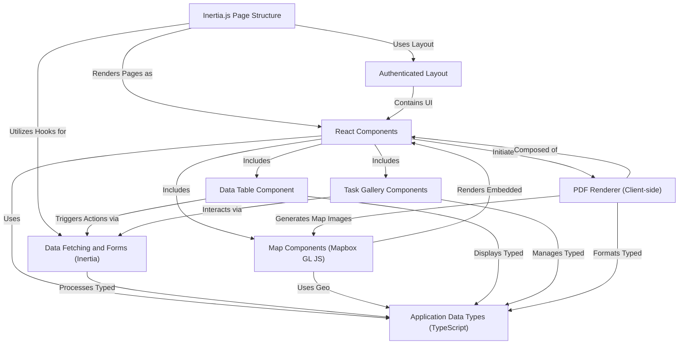

# Tutorial: code_to_analyze

This project is a web application using **Laravel**, **React**, and *Inertia.js* to manage field work data.
It allows users to handle **tasks**, view and manage associated **photos** with location data, track **geographical paths**, and generate **PDF reports** of collected information.
It aims to streamline data collection and review processes for land or task management, providing separate interfaces for different user roles.

**Source Repository:** [None](None)

## Chapters

1. [Authenticated Layout
](01_authenticated_layout_.md)
2. [Inertia.js Page Structure
](02_inertia_js_page_structure_.md)
3. [React Components
](03_react_components_.md)
4. [Application Data Types (TypeScript)
](04_application_data_types__typescript__.md)
5. [Data Fetching and Forms (Inertia)
](05_data_fetching_and_forms__inertia__.md)
6. [Data Table Component
](06_data_table_component_.md)
7. [Task Gallery Components
](07_task_gallery_components_.md)
8. [Map Components (Mapbox GL JS)
](08_map_components__mapbox_gl_js__.md)
9. [PDF Renderer (Client-side)
](09_pdf_renderer__client_side__.md)

---

Generated by [AI Codebase Knowledge Builder](https://github.com/The-Pocket/Tutorial-Codebase-Knowledge)